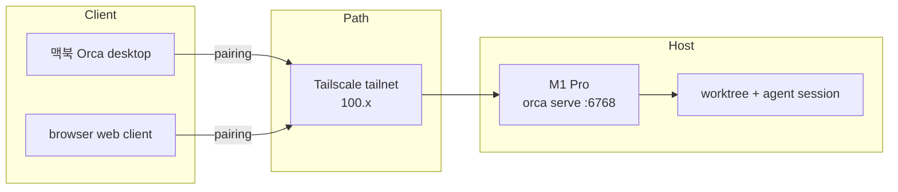

# Orca Serve 로 Dev Server 를 띄우니 노트북에서 해방된다

> [!abstract] TL;DR
> 개발 서버를 `orca serve` 로 붙여 두면 session 이 서버에서 산다. 노트북을 닫아도 작업이 멈추지 않는다.

Senior AI Lab 을 창업하고 서울에 자주 가게 됐다. 일은 타지역에 있고 몸은 계속 오간다. 그때마다 맥북 상시 켜두기, 빵빵한 보조배터리, 핫스팟이 세트로 따라다녔다. 노트북 하나에 repo 와 agent session 과 local server 가 다 실려 있어서다. 가방을 닫는 순간 돌아가던 루프도 같이 접힌다.

2026-08-16 에 결론을 적어뒀다. 개발을 맥북에서 하지 말자. 개발 장소를 분산시켜서 이동에서 오는 리스크를 mitigation 하자. 수단은 Orca 다.

오늘 보니 Orca 의 `serve` 가 정확히 이걸 지원한다. 그래서 내 개발 서버들을 붙였다. 처음엔 연결이 걱정이었는데, pairing 이 되니까 안전하게 연결할 수 있는 길이 열렸다. 딜레이도 생각보다 없고 안정적이다. session 이 서버에서 켜져 있으니 노트북을 닫고 다녀도 작업이 안 멈춘다. 필요한 건 이동과 분리된 개발 장소였다.

## `orca serve` 가 만드는 것은 Dev Server 다

`serve` 는 desktop app 없이 runtime 만 띄운다. 포트와 pairing address 를 정하면 그 머신은 agent 가 사는 서버가 된다.

```bash
orca serve --port 6768 --pairing-address <tailscale-ip>
```

붙는 쪽은 Orca desktop 이어도 되고, 같은 포트의 web client 여도 된다. pairing code 한 줄이면 원격 runtime 이 environment 로 저장된다. 그다음부터 `orca status` 와 `orca worktree ps` 는 그 host 를 가리킨다.

오늘 확인한 M1 Pro 가 딱 그 그림이었다.

- runtime 은 ready, desktop app 은 꺼져 있다
- worktree 위에서 Claude Code agent 가 이미 일하고 있다
- 노트북의 로컬 Orca 는 별도 runtime 이고, 실제 루프는 고정 머신에 있다

Tailscale 이 이 구조를 받쳐준다. 공인망에 포트를 열지 않아도 tailnet 안에서 `100.x` 로 runtime 에 닿는다. 예전에 OpenClaw 를 Tailscale 로 붙이던 습관 이 이번엔 Orca 의 pairing 으로 이어진 셈이다.

## 결국 연결에 가치가 있다

Aside 는 connect 를 해주고, Orca 도 connect 를 해준다. Aside 는 browser agent 라서 브라우저로 할 수 있는 모든 일을 연결해주고, Orca 는 runtime 을 서버에 붙여서 개발 장소를 연결해준다. 여러 에이전트를 여러 서버에 붙이면 그 연결 자체가 가치가 된다. 나는 규칙만 필요하게 된다. Agent 시대에 무엇을 해야 할꼬 에서 말한 루프를 만드는 능력이 여기서도 그대로다.

같은 논리로 다음 host 가 보인다.

- 다른 개발 서버들을 더 붙이면, 장소마다 clone 하던 일이 입구 전환 한 번이 된다
- Hermes 를 올려 둔 VPS 에 붙이면, Hermes Operations 루프도 노트북 전원과 분리된다
- 더 나아가면 배포 서버에도 연결해볼 수 있다. 내가 작업하는 서버들을 다 붙여두면 엄청 편할 거다

단, 배포 서버는 권한 경계가 먼저다. 편의는 접근 경로를 늘리고, 늘어난 경로는 감사 대상이 된다.

## 핵심은 Session 이 어디에 사느냐다

노트북에서 Claude Code 를 켜면 그 session 은 노트북의 전원과 위치와 배터리에 묶인다. `orca serve` 로 host 를 분리하면 agent 는 내가 카페에 있든 기차에 있든 같은 디스크, 같은 repo, 같은 terminal 을 본다.

오늘 M1 Pro 에는 Documents 와 Oh My Second Brain 이 올라가 있었다. 한쪽 terminal 은 이미 다음 revision 을 기다리고 있었다. 내가 그 앞에 앉아 있지 않아도 루프는 계속 돈다.

구성은 세 층이다.

- **Host**: 고정 머신에서 `orca serve` 가 runtime 을 유지한다
- **Path**: Tailscale 이 그 runtime 을 사설망으로 노출한다
- **Client**: 노트북과 브라우저는 thin client 다. 작업의 원본이 아니다



개발 장소를 분산한다는 건 한 host 를 여러 입구에서 쓰고, 그 host 목록을 늘려간다는 뜻이다.

## 이제 쓰는 방식

새 작업을 시작하기 전에 원격 host 가 살아 있는지 먼저 본다.

```bash
orca status --json
orca worktree ps --limit 10 --json
```

살아 있으면 그 worktree 에 붙는다. 죽어 있으면 고정 머신에서 `orca serve` 를 다시 올린다. pairing 은 한 번이면 충분하다. 습관은 하나만 남는다. 가방 싸기 전에 루프를 끄지 않는다.

이제 다른 개발 서버들도 붙여두면 더 재밌어질 거 같다.

## References

- [Threads — 고범수 | Beomsu Koh (@hebrews_0218)](https://www.threads.com/@hebrews_0218/post/DcG04dIk5i3)
- [Tailscale](https://tailscale.com/)
