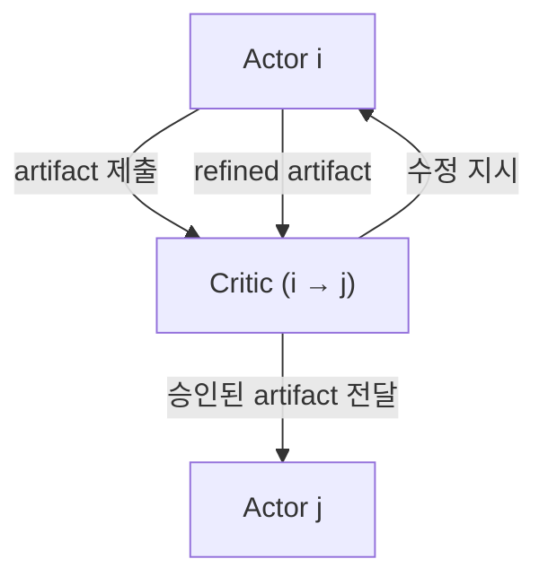

> [!tldr] TL;DR
> 문제: 기존의 multi-agent 는 소규모에서는 효과적이지만, 구조 없는 확장은 coordination & context 비용으로 인해 성능이 붕괴된다.
> 접근: 효과적인 agent scaling 을 위해 DAG 기반 multi-agent collaboration network(MACNET) 을 설계했다.
> 관찰: agent 수 증가에 따라 성능은 logistic growth 형태로 증가했으며, 불규칙한 topology 가 규칙적인 구조보다 일관되게 우수했다.
> 한 줄 요약: 뉴런 수를 늘리면 성능이 좋아졌듯, 에이전트 수도 늘리면 성능이 좋아지지 않을까?
## Introduction

LLM 기반 연구에서 multi-agent 협업이 단일 agent 보다 우수한 성능을 보인다는 점은 확인되었지만, 기존 연구에서는 agent scale 을 키우는 문제가 상대적으로 간과되었다. 일부 연구가 수십 개 수준을 다루긴 했으나, 대부분은 10 개 미만의 agent 를 사용했다.
Neural network 에서 뉴런 수를 늘릴 때 성능이 증가하는 scaling law 가 관찰되었듯, agent 수에도 유사한 scaling law 가 적용될 수 있지 않을까라는 의문에서 연구가 시작되었다.

> [!question] Research Question
> 어떻게 효과적인 agent scaling 을 할 수 있을까? 과연 agent scaling 은 성능을 향상시킬까?

하지만, 효과적인 agent 의 협업을 위해서는 단순히 agent 의 갯수를 늘려서 다수결 투표 (majority voting) 방식에 의존 할 수 없다. 효과적인 scaling 을 위해서는 ==scalable networking, cooperative interaction, and progressive decision-making== 이 필요하다. 네트워크 확장이 용이하며, 상호 협력과 점진적인 의사결정을 할 수 있어야 한다.

> Majority voting(다수결) 은 interaction 과 refinement 가 없고, agent 수가 증가할수록 정보 중복과 비용이 증가할 수밖에 없는 구조라 한계가 있다.


해당 연구에서는 이를 위해서 multi-agent collaboration network (MACNET) 을 제안하였다.

## 실험/접근 방법



> **효과적인 agent scaling 을 위한 구조적 조건은** **scalable networking, cooperative interaction, progressive decision making**의 세 요소로 요약될 수 있다.

MACNET 은 이러한 조건을 만족시키기 위해, **agent 간 상호작용의 순서와 정보 흐름을 구조적으로 제약하는 Directed Acyclic Graph(DAG) 기반의 협업 네트워크**로 설계되었다. 여기서 DAG 는 단순한 구현 선택이 아니라, 대규모 agent 협업을 가능하게 하는 **최소한의 구조적 제약**으로 기능한다.

DAG 는 방향성을 가지면서 순환이 없는 그래프로, 정보의 **backflow**를 구조적으로 차단하고 task-specific 한 cycle breaking 을 불필요하게 만든다. 순환 구조 (A → B → C → A) 를 허용할 경우, agent 수가 증가함에 따라 상호작용 비용이 급격히 증가할 뿐만 아니라, 잘못된 중간 판단이나 hallucination 과 같은 **local error 가 반복적으로 증폭·전파될 위험**이 존재한다.

반면, DAG 구조에서는 상호작용이 위상적 순서에 따라 진행되므로, 의사결정이 단계적으로 축적되는 **progressive decision making**이 가능하며, 전체 협업 과정이 **유한한 단계 내에서 종료됨이 구조적으로 보장**된다. 그 결과, 각 agent 나 노드 수준에서 별도의 종료 조건을 설계할 필요가 없다.

그렇다면, 이러한 구조적 제약을 토대로 어떤 형태의 네트워크 (topology) 가 필요하며, 각 구성 요소가 어떤 역할로 어떻게 상호 작용할지 또한 대규모 협업에서 발생하는 context explosion 을 어떻게 제어할지를 알아보자

> “A graph will orchestrate agent interactions, akin to social networks where information propagates through directed edges. Intuitively, ==the acyclic nature prevents information backflow, eliminating the need for additional designs like task-specific cycle-breaking, thereby enhancing generalizability and adaptability across contexts==.” (Qian et al., 2025, p. 3)


### 네트워크 (Topology) 구성은 어떻게 되어야 할까
> 이 모양이 어떻게 생겼을까

이 논문에서는 2 depth 의 구조를 제공한다. chain, tree, graph 이다.


- Chain:
	- linear structure ([[Waterfall Model]] 유사)
- Tree:
	- Star (wider), Tree (deeper)
- Graph:
	- Mesh (fully-connected), Layer (Multi-Layer Perceptron shaped), Random (irregular)

### **Interactive Reasoning**: 어떻게 Agent 간에 상호 작용을 하는가
MACNET 에서 **노드 (node)** 와 **엣지 (edge)** 는 모두 LLM 기반 agent 로 구현된다. 노드 (Actor, $a_i$) 는 입력된 artifact 를 받아 수정된 artifact 를 생성하며, 현재 artifact 의 버전과 해당 시점의 결정 결과를 유지한다. 엣지 (Critic, $a_{ij}$) 는 노드 $v_i \rightarrow v_j$ 에 대응하는 중재자 (agent) 로, artifact 를 직접 생성하지 않고 수정 방향과 적용 기준에 대한 **directional instruction**만 제공한다.

#### Topological Order 를 따르라
Agent 간 상호작용은 DAG 의 **topological ordering**에 의해 구조적으로 제한된다. 즉, 각 방향 엣지 $v_i \rightarrow v_j$ 에 대해 아래 수식을 만족한다.
$$I(a_i) < I(a_{ij}) < I(a_j)$$
위의 순서가 강제되며, 이는 **Actor → Critic → 다음 Actor**의 의사결정 흐름을 의미한다. 이 순서 제약 하에서 병렬 실행은 허용되지만, 의존성은 위배되지 않는다.

DAG 의 node 와 edge 는 multi-turn 대화를 통해 아래 과정을 반복한다. 먼저 $a_i \leftrightarrow a_{ij}$ 구간에서 Critic 이 피드백을 제공하고 Actor 가 artifact 를 정제 (refine) 한다. 이후 $a_{ij} \leftrightarrow a_j$ 구간에서 정제된 artifact 가 Critic 을 통해 다음 Actor 에게 전달되어 추가 개선이 이루어진다.

#### Dataflow 는 Node 와 Edge 기반으로 동작한다
MACNET 에서 dataflow 는 artifact 가 네트워크 내에서 전달되는 경로를 의미하며, artifact 는 연결된 노드들의 topology 에 따라 전달된다.
### 고려 사항 : Memory Control
Agent scaling 의 위험성은 제약 없는 정보 교환이 context explosion 을 일으킨다는 점이다. 예를 들어 memory control 없이 n 개의 agent 가 각각 n 개의 memory 를 주고받는 구조라면 비용은 $O(n^2)$ 로 증가한다. 본 논문은 short-term/long-term memory 설계를 통해 대화 히스토리를 버리고 최종 artifact 중심으로 유지함으로써 복잡도를 완화한다.

> [!warning] Memory Control (Context Explosion)
> 무제한 정보 교환은 컨텍스트 폭발을 유발할 수 있음.
> 본 논문은 short-term/long-term memory 로 대화 히스토리를 버리고 최종 artifact 중심으로 유지해 복잡도를 완화.

- Short-term memory:
	- 각 interaction 내 working memory
	- task, role prompt, current artifact
- Long-term memory:
	- 최종 결과물이 될 artifact 만 유지

Short-term memory 는 각 interaction 에서의 working memory 로서 task, role prompt, current artifact 를 포함한다. Long-term memory 는 최종 결과물이 될 artifact 만 유지한다. 즉, n 개의 agent 가 short-term memory 를 로컬하게 사용하되 long-term 에는 최종 artifact 만 남겨 대화 history 를 버림으로써 저장/전달 복잡도를 $O(n)$ 로 낮춘다.

## 결과, 관찰값
> Performance 비교
> - MACNET-Chain 이 대부분의 metric 에서 baseline 을 능가
> - MACNET-Random 이 평균 Quality 에서 최고 성능 (0.6522)
> - 특정 task 에 특정 topology 가 더 적합: chain → software development, tree → creative writing

### Topology 분석을 어떻게 할 것인가?


#### Density Perspective : 얼마나 많이 연결 되었는가


- 높은 interaction density 가 평균적으로 좋은 성능을 보임 (mesh > tree > chain)
	- 작업 특성에 따라서 편차가 존재한다고 추정이 된다.
		- Chain structure 가 softwareengineering 에서는 성능이 잘나온다. 그 이유는 software engineering 의 경우 linear process 를 따르기 때문이다.
		- 높은 창의성을 요구하는 다양한 직업에 있어서는 다양한 에이전트 간의 연결이 더 유리 할 수 있다.
		- 하지만, Density 가 항상 최적의 퍼포먼스를 보이는 것이 아님을 시사

높은 interaction density 가 평균적으로 좋은 성능을 보였다 (mesh > tree > chain). 다만 작업 특성에 따라 편차가 존재하는데, 예를 들어 software engineering 에서는 linear process 를 따르는 경향이 있어 chain 구조가 더 잘 작동할 수 있다. 반면 높은 창의성을 요구하는 작업에서는 다양한 agent 간 연결이 더 유리할 수 있다. 또한 density 가 항상 최적의 성능을 보장하지는 않는다는 점도 시사된다.

#### Shape Perspective : 그래프 패턴이 어떻게 구성이 되었나
Irregular topology(random) 가 regular topology 를 outperform 하는 것이 관찰되었다. 이는 지나치게 밀집된 상호작용이 agent 들에게 정보 부하를 주어 효과적인 reflection 과 refinement 를 저해했기 때문으로 해석된다. 또한 small-world properties 가 성능 향상에 기여했는데, 경로가 짧을수록 정보 전달 및 정제가 수월해지기 때문이다. 참고로 random topology 는 mesh 대비 약 52% 의 시간 절감도 보고되었다.

#### Direction Perspective
Divergent topology 가 convergent topology 보다 우수했으며, 발산 구조에서는 더 다양한 의견을 고려할 수 있어 성능이 좋아지는 것으로 해석된다. 또한 artifact propagation 역시 divergent structure 에서 더 smooth 하게 진행되었다.
### 그래서… Agent 에서 Scaling Law 가 성립이 되었는가

Logistic 하게 에이전트가 늘어날수록 성능이 증가하는 것이 관측이 되었다.

하지만, agent 의 수가 늘어나서 지능이 좋아졌다는 것보다 Task 를 풀 때 다양한 측면을 agent 들이 상호작용에서 고려하게 됨으로써 성능이 증가하는 것으로 여겨진다.

## 결론
MACNET 이 효과적으로 작동하며 collaborative scaling law 가 존재함을 확인했다. 다만 MACNET 을 구성할 때 어떤 topology 와 어느 정도의 agent scaling 이 최적인지는 task 시나리오에 따라 달라질 수 있다. 한계로는 scaling law 를 관찰하긴 했지만, 어떤 구조가 어떤 시나리오에서 최적인지까지는 밝히지 못했다는 점이 있다.

정리하면, MACNET 은 평균적으로 모든 baseline 을 압도했고 1000+ agent collaboration 을 효과적으로 지원했다. 또한 성능이 logistic growth pattern 으로 향상되는 collaborative scaling law 를 발견했으며 (용어는 본 논문에서 처음 정의), agent 수를 스케일링할 때는 불규칙 (irregular) topology 가 규칙적 (regular) topology 보다 평균적으로 더 높은 성능을 보였다 (Regular: Chain, Star, Tree, Layer / Irregular: Random, Mesh). 마지막으로 agent collaboration 은 training-time scaling 의 대안으로 inference-time procedural thinking 을 제공하여, Training 이 아닌 Inference 단계에서 성능 향상을 가능하게 하는 “shortcut” 역할을 할 수 있다.

## Questions

### Critic 마다 정말 다른 역할이 부여되는가?

Review 를 하면서 Critic의 역할에 대한 질문을 받았다. 논문을 읽으면 각 Critic은 edge에 배치되어 두 노드 사이를 중재하는 역할을 한다고만 나와 있다. 그렇다면 모든 Critic이 동일한 "감독자" 역할만 수행하는 것일까, 아니면 각 Critic마다 전문화된 다른 역할을 가지는 것일까?

논문의 Equation 2를 보면 각 agent가 "professional roles"를 가진다고 명시되어 있으며, Section 3.1의 ablation study에서 agents' profiles를 제거했을 때 평균 3.67%의 성능 하락이 관찰되었다. 이는 각 agent의 전문화된 역할이 실제로 성능에 기여함을 시사한다. 더 구체적으로, Section 3.4의 Figure 8을 보면 ChatDev 구현에서 54개의 서로 다른 aspects를 검토하는 것으로 나타났다 (Syntax Errors, Runtime Errors, Logic Errors, Security Vulnerabilities, Performance Issues 등). 만약 모든 Critic이 동일한 역할을 수행한다면 이렇게 다양한 측면을 검토할 수 없을 것이다.

실제 [GitHub ChatDev MACNET 브랜치](https://github.com/OpenBMB/ChatDev/tree/macnet)의 구현을 확인해보니, 각 Phase마다 서로 다른 Critic 클래스가 정의되어 있었다. 예를 들어, `phase.py`에서 `DemandAnalysis` Phase는 CEO가 Critic 역할을, CPO가 Actor 역할을 수행하며, `Coding` Phase에서는 CTO가 Critic으로, Programmer가 Actor로 배치된다. `CodeReviewComment` Phase에서는 Code Reviewer가 Critic이 되고, `TestModification` Phase에서는 Test Engineer가 Critic 역할을 맡는다. 즉, 개발 프로세스의 각 단계마다 해당 단계에 전문화된 역할이 Critic으로 배치되는 구조다.

더 흥미로운 점은 `SRDD_Profile` 시스템의 존재다. ChatDev 구현에는 `./SRDD_Profile/{category}/{1-99}.txt` 형태로 40개 카테고리 × 100개 프로필 = 4,000개의 서로 다른 role prompt가 준비되어 있다. 예를 들어 `Development/1.txt`는 알고리즘 전문가, `Development/10.txt`는 모바일 개발 전문가, `Entertainment/15.txt`는 AI/ML 전문가, `Finance/22.txt`는 배포/위험 관리 전문가 등 각 프로필마다 고유한 전문성과 스킬셋이 정의되어 있다. 그리고 `graph.py:400-439`의 `agent_deployment(self, _type)` 메서드를 보면 다음과 같은 코드가 있다:

```python
profile_num = random.randint(1, 99)
with open(f"./SRDD_Profile/{_type}/{profile_num}.txt", "r", encoding="utf-8") as f:
    self.nodes[node.id].system_message = f.read()
```

즉, 각 노드가 생성될 때마다 1-99 범위에서 무작위로 프로필을 선택하여 서로 다른 전문성을 부여하는 것이다.

그렇다면 왜 논문에서는 이러한 role 차별화를 명시적으로 기술하지 않았을까? 세 가지 이유를 추측할 수 있다. 첫째, 논문의 핵심 기여는 "DAG 기반 협업 구조"와 "agent scaling law"이며, role assignment는 구현 세부사항으로 간주되었을 가능성이 있다. 둘째, ChatDev라는 특정 application domain(소프트웨어 개발)의 구현 예시이기 때문에, 범용적인 MACNET 프레임워크를 설명하는 논문에서는 domain-specific한 role system을 깊이 다루지 않았을 수 있다. 셋째, 4,000개의 프로필과 무작위 할당 메커니즘은 실험 재현성과 공정성 측면에서 논란의 여지가 있어 의도적으로 간략히 언급했을 가능성도 있다.

결론적으로, 각 Critic마다 다른 역할이 부여된다는 강력한 증거가 4가지 수준에서 확인된다: (1) 논문의 ablation study에서 profiles 제거 시 3.67% 성능 하락, (2) 54개의 서로 다른 검토 aspects, (3) phase별로 전문화된 Critic 클래스 (CEO, CTO, Code Reviewer, Test Engineer 등), (4) 4,000개의 SRDD_Profile 시스템과 무작위 할당 메커니즘. 따라서 MACNET에서 각 Critic은 동일한 감독자가 아니라, 각자의 전문 영역을 가진 domain expert로 기능한다고 볼 수 있다.
