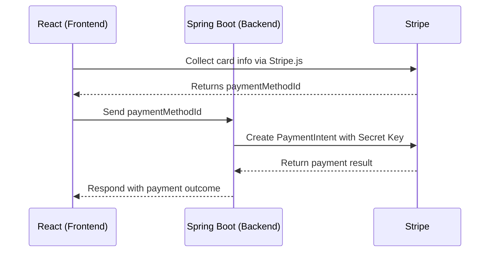

## Integration with Stripe for Payment Validation
- **Front-End Process**
    - The front-end collects card information and securely transmits it to Stripe using Stripe.js.
    - Stripe returns a unique `paymentMethodId` in response.

- **Back-End Process**
    - The back-end receives the `paymentMethodId` and uses it to create a `PaymentIntent` with Stripe.
    - Stripe processes the payment and returns the result to the back-end, which then communicates the outcome to the front-end.


- **Current Implementation Status**
    - All users can currently make purchases without restrictions, which may lead to potential bugs.​
    - Exception handling and card storage functionalities are not yet implemented.​
### Front-End Guidelines
- **Important Considerations**
    - **Stripe's Client-Side Restrictions**
        - Card information must be collected and transmitted using Stripe's client-side libraries.
        - Direct server-side submission of card details is prohibited.
        - Testing payment logic should be conducted using Stripe's client-side library, not tools like Postman.

- **Requirements**
    - **Public Key**
        - Obtain the public key from the team's Notion resources page.
    - **Libraries** : Install the following Stripe libraries:​
        - `@stripe/react-stripe-js`
        - `@stripe/stripe-js`

- **Integration Steps**
    - Refer to [Accept card payments without webhooks | Stripe Documentation](https://docs.stripe.com/payments/accept-a-payment-synchronously?platform=web#add-stripe.js-and-elements-to-your-page) for detailed guidance.
    - **Process Overview**
        - Use Stripe.js to collect card information and obtain a `paymentMethodId`.
        - Send the `paymentMethodId` to the back-end for payment processing.

- **Backend API Endpoint**
	- Method: POST
	- URL: `http://localhost:8000/api/v1/payments`

	```json
	{
	    "userId": 1,
	    "countryPanelId": 1,
	    "amount": 100.00,
	    "paymentType": "STRIPE",
	    "paymentMethodId": "pm_card_visa"
	  }
	```
#### How to Test Payments
The Front-End team can use the following test `paymentMethodId` options provided by Stripe for testing purposes:

```
pm_card_visa - Successful payment test
pm_card_mastercard - Successful payment test
pm_card_visa_chargeDeclined - Charge declined test
pm_card_insufficientFunds - Insufficient funds test
pm_card_authenticationRequired - Authentication required test
```

Use these identifiers as the `paymentMethodId` when making test requests to the backend API.
### BACKEND
**Payment Processing**
- **Receiving Payment Method ID**
    - Accept the `paymentMethodId` from the front-end.

- **Creating Payment Intent**
    - Use the `paymentMethodId` to create a `PaymentIntent` with Stripe.
    - Ensure the use of the secret key when communicating with Stripe's API.

- **Handling Payment Outcome**
    - Process the payment result returned by Stripe.
    - Implement appropriate exception handling and error responses.