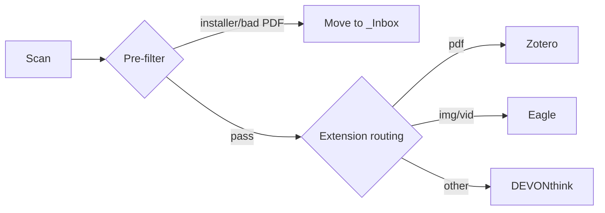
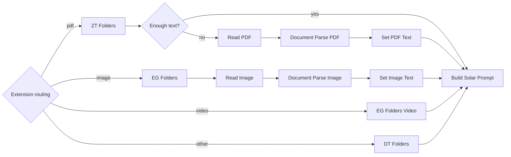

> [!tldr]
> A no-code workflow that automatically classifies files piling up in Downloads, Documents, and Desktop using n8n + Upstage API, then imports them into Zotero (PDFs), Eagle (images/videos), or DEVONthink (everything else).

## The Problem

Every file you download on macOS lands in the Downloads folder. PDFs need to go into Zotero, screenshots into Eagle, and the rest into DEVONthink — but doing this manually every single time creates two recurring headaches:

1. **Filenames are meaningless** — names like `CleanShot 2026-03-26 at 17.57.45@2x.png` or `document(3).pdf` are impossible to find later
2. **App routing is tedious** — for every file, you have to decide which app gets it, open that app, and trigger the import

This workflow solves both problems automatically: Upstage Document Parse extracts the file's content, and Solar Pro 3 decides the destination folder and a clean filename. It runs every 10 minutes with zero user interaction.

## Motivation

With powerful automation tools like Claude Code and OpenClaw already available, what makes the n8n + Solar combination worth using? The answer is **always-on, event-triggered automation**. Claude Code's collaborative mode runs in a sandbox and can't directly access local folders. OpenClaw is resource-heavy to run as a persistent daemon. The simplest path to always-on automation is n8n.

My specific problem: files accumulate in Downloads, Documents, and Desktop. Without periodic cleanup, they pile up and get forgotten. I wanted an automated system that handles this without intervention. The solution: a **local file auto-classification system** built on the Upstage API (Document Parse + Solar Pro 3). When a file appears, it analyzes the content and imports it into the right app.

I use three apps for different file types: Zotero for PDFs, Eagle for images and videos, and DEVONthink as a general-purpose database for everything else (webarchives, documents, etc.).

| App | Target Files | Import Method |
|-----|-------------|---------------|
| Zotero | PDFs | `zt import` / `zt create:item` + `zt attach` |
| Eagle | Images, videos | `eg import:path` |
| DEVONthink | Everything else | `dt add` |


The overall flow is Scan → Extract → Classify. Files accumulated in Downloads, Documents, and Desktop are scanned, their content is extracted via Upstage Document Parse, and then Solar Pro 3 decides the target folder and filename. The final import happens through each app's CLI.

## File Classification Pipeline

### Stage 1: Pre-filtering + App Routing (Stage & Categorize)

This is the pipeline's gatekeeper. It filters out unnecessary files before any Solar API calls. Hidden files, empty files, and installers are skipped or moved to `_Inbox`. PDFs are validated against the `%PDF-` header to catch corrupt files.

| Condition | Action |
|-----------|--------|
| Hidden / empty / temporary files | skip |
| Installers (`.dmg`, `.pkg`, `.app`, `.iso`) | move to `_Inbox` + skip |
| Invalid PDF (missing `%PDF-` header) | move to `_Inbox` + skip |

Files that pass the filter proceed as follows:



Each run processes at most 12 files, with PDFs capped at 4. The PDF cap exists because Document Parse API calls are expensive and slow — OCR has a 60-second timeout per file, so too many PDFs blow out the total processing time.

Deduplication is handled structurally rather than tracked explicitly. Once a file completes the pipeline, the original is either deleted or moved to `_Inbox`, so it won't be picked up again on the next run. With a 10-minute schedule and sub-1-minute processing time, runs don't overlap.

The n8n Switch node splits by file extension into separate branches, and each branch processes files sequentially — so the same app never receives concurrent imports. **The branch structure itself acts as a per-app queue.**

App selection is locked to extension at this stage; Solar never overrides it. Each app has a fixed domain: Eagle handles media, Zotero handles PDFs, DEVONthink handles everything else.

#### File Safety: Staging Move

Between when Stage & Categorize records a file path and when processing completes, up to 30–100 seconds can pass. During that window, an external app (like CleanShot) might rename or move the file, causing an `ENOENT` error downstream. To prevent this, files are immediately moved to `~/.n8n-organizer/staging/` via `fs.renameSync` (an atomic move) as soon as they're discovered.

- All downstream nodes work off the staging path (`filePath`)
- The original path is preserved in `originalPath` for logging
- Crash recovery: at the start of each run, any file that has been sitting in staging for over 30 minutes is restored to `_Inbox`

### Stage 2: App Extract

Stage 2 has two sub-steps: **fetching folder lists** and **extracting content**.

#### 2-1. Folder List Fetch

The actual folder/collection lists from each app are fetched via CLI, with a 30-minute TTL cache. Fetching the full folder tree for every file would create a bottleneck, so caching is applied. A 30-minute TTL fits well with the 10-minute schedule.

| App | CLI Command | Description | Output Format |
|-----|-------------|-------------|---------------|
| Zotero | `zt collections` | Returns full collection list as JSON | `ZK3ATEUT \| 00. Inbox` (key \| name) |
| Eagle | `eg folder:list` | Returns folder tree recursively as JSON | `M8RRO78FRS1VZ \| Resources/Meme` (id \| path) |
| DEVONthink | `dt databases --property name` | Returns database list, name field only | `[{"name": "01. Personal"}]` |
| | `dt groups --db "DB_NAME" --property name` | Returns top-level groups for a DB | `[{"name": "00. Inbox"}, ...]` |
| | `dt groups --db "DB_NAME" "/group_name" --property name` | Returns sub-groups | `[{"name": "startup"}, ...]` |

#### 2-2. Content Extraction

Content extraction branches by file extension. PDFs and images call the Upstage Document Parse API explicitly via n8n's **HTTP Request node**, making the data flow visible directly in the workflow UI. This replaced the previous approach of hiding `curl` calls inside Code nodes.

- **PDF**: extract text via `mdls` (Spotlight) → if under 300 characters, run OCR via Upstage Document Parse API (`HTTP Request` node)
- **Image**: extract text via Upstage Document Parse API (`HTTP Request` node)
- **Video**: no content extraction — goes straight to Solar classification based on filename
- **Other**: filename-based classification

Videos can't be analyzed by Document Parse, so they pass only the folder list and filename to Solar.



### Stage 3: Solar Pro 3 — Folder Classification + Filename Generation

The extracted text, original filename, and the target app's folder list are passed to Solar Pro 3. Solar never changes the app assignment from Stage 1 — it only handles folder selection and filename generation:

```json
{
  "document_type": "academic_paper",
  "target_folder": "ZK3ATEUT",
  "new_filename": "2026-03-25_AI_기반_정보_자동_분류.pdf",
  "rating": 8,
  "criteria": {
    "folder_match": 9,
    "filename_quality": 7,
    "content_understanding": 8
  },
  "feedback": "AI 관련 학술 자료로 Zotero 컬렉션에 적합",
  "language": "ko"
}
```

The initial implementation used a single `confidence` score, which turned out to be meaningless without calibration (Solar would return 0.95 even for wrong classifications). This was replaced with a **multi-criteria evaluation system**:

| Criterion | Description |
|-----------|-------------|
| `folder_match` | How well the selected folder fits the file content (1–10) |
| `filename_quality` | How accurately the generated filename describes the content (1–10) |
| `content_understanding` | How precisely Solar understood the file content (1–10) |

The pipeline branches based on the overall `rating`:

| Rating | Action |
|--------|--------|
| 9–10 | Normal import + high-confidence notification |
| 6–8 | Normal import |
| 1–5 | Inbox fallback (requires manual review) |

The `reasoning_effort` parameter is set differently per file type. PDFs and images use `high` (deeper reasoning needed); videos and other files use `medium` (simple filename-based classification).

Solar's JSON response is validated in the `Parse Solar Response` node using a **bidirectional lookup map**. Whether Solar responds with a key or a name, both are normalized. If neither matches, the file falls back to the default inbox folder.

| App | Fallback Location | Format |
|-----|-------------------|--------|
| Zotero | `00. Inbox` | key: `8UZJ5THD` |
| Eagle | root | folderId omitted |
| DEVONthink | `/00. Inbox` | group path |

> [!important] Validated with Multi-Criteria Evaluation
> Instead of a single confidence score, classification is evaluated across three axes: folder_match, filename_quality, and content_understanding. Any combined rating below 6 automatically falls back to Inbox, and the individual scores along with feedback are written to the log.

### Stage 4: Import

The Import Router branches into three paths based on the `targetApp` value. All three paths check whether the app is running via `pgrep`, launch it with `open -a` if it isn't, and then perform the import.

| App | CLI Command | Parameters | Notes |
|-----|-------------|------------|-------|
| Zotero | `zt import FILE --collection COL` | `FILE`: file path to import, `--collection`: target collection key | On failure: two-step fallback via `zt create:item --type document --title TITLE --collection COL` + `zt attach FILE --key KEY` |
| Eagle | `eg import:path --path FILE --name NAME --folderId FID` | `--path`: file path, `--name`: display name, `--folderId`: target folder ID | Quotes stripped from filename before passing to `--name` |
| DEVONthink | `dt add FILE --db "01. Personal" --at PATH --name NAME` | `FILE`: file path, `--db`: target database, `--at`: group path, `--name`: display name | Fixed database: `01. Personal` |

### Stage 5: Cleanup & Logging

The pipeline branches based on import success.

| Result | Action |
|--------|--------|
| Success | Delete the original file |
| Failure | Move the original to `~/Downloads/_Inbox/` |

In both cases, a JSON log entry is appended to `~/.n8n-organizer/log.jsonl` and a macOS notification is displayed via `osascript`.

## Upstage API Usage

### Document Parse (endpoint: `document-digitization`, model: `document-parse`)

| Target | Mode | Purpose |
|--------|------|---------|
| PDF (when mdls returns < 300 chars) | `document-parse`, `ocr=auto` | Text extraction from scanned PDFs |
| Images (screenshots, charts) | `document-parse`, `ocr=auto` | Text and diagram description from screen content |
| General photos | `document-parse`, `ocr=auto` | **Limitation**: cannot analyze landscapes, people, or food |

### Solar Pro 3 (`chat/completions`)

- Text-only model (102B MoE)
- Determines filename and folder based on text extracted by Document Parse
- Cannot analyze images directly — depends on Document Parse's text output
- `reasoning_effort`: PDF/image → `high`, video/other → `medium`
- Returns multi-criteria evaluation JSON schema: `rating` (overall score) + `criteria` (folder_match, filename_quality, content_understanding) + `feedback`

## Node Breakdown (v5, 33 nodes)

| Type | Count | Role |
|------|-------|------|
| Schedule/Manual Trigger | 2 | 10-minute schedule, manual testing |
| Code | 6 | Stage & Categorize, ZT Folders, EG Folders, EG Folders Video, DT Folders, Parse Solar Response |
| Execute Command | 7 | CLI imports (Zotero/Eagle/DEVONthink), file cleanup, notifications, log writing |
| Set | 8 | Prompt assembly, fallback data, import result mapping (3), log preparation, PDF/image text setting (2) |
| HTTP Request | 3 | Solar Pro 3 API call, Document Parse PDF, Document Parse Image |
| ReadWriteFile | 2 | Read PDF, Read Image |
| Switch | 2 | Extension routing, app routing |
| If | 3 | Solar Response Success?, Import Success?, PDF Text OK? |

### Fault Tolerance

Most IO nodes have `continueOnFail` set, so a single file failure doesn't halt the entire pipeline. Import nodes verify file existence with `[ ! -f "$FP" ]` before running. If Solar response parsing fails, the node strips markdown code fences and retries. Content text is truncated to 4,000 characters to prevent Solar's context window from overflowing.

## Migration: Minimizing Code Nodes

The initial workflow had 10 Code nodes with over 400 lines of JavaScript. Code nodes make it hard to trace data flow in the n8n UI. Following a "only convert what's a sure bet" principle, 4 Code nodes were replaced with native nodes.

| Target | Before | After |
|--------|--------|-------|
| Fallback Solar Response | Code (40 lines) | **Set node** |
| Import to Zotero | Code (65 lines) | **Execute Command + Set** |
| Import to Eagle | Code (40 lines) | **Execute Command + Set** |
| Import to DEVONthink | Code (40 lines) | **Execute Command + Set** |

**Issues encountered during migration:**

1. **CLI stdout swallowing the "OK" marker** — tools like `dt add` print JSON to stdout, which interfered with success detection → fixed by adding `>/dev/null`
2. **ReadWriteFile binary errors** — the Append Log node was replaced with an Execute Command heredoc
3. **Deduplication concerns** — handled structurally by deleting or moving files after processing; no hash tracking needed

## Operational Tips

PM2 keeps the n8n process running persistently. `ecosystem.config.js` sets `autorestart: true` for crash recovery and `max_memory_restart: '512M'` for memory leak recovery.

```bash
# Start
pm2 start ecosystem.config.js

# Check status
pm2 status n8n-organizer

# View logs
pm2 logs n8n-organizer --lines 50
```

### Config Files

| Path | Purpose |
|------|---------|
| `~/.n8n-organizer/zt-token` | Zotero CLI token |
| `~/.n8n-organizer/folder-choices-cache.json` | Folder list cache (30-minute TTL) |
| `~/.n8n-organizer/log.jsonl` | Processing log (JSONL) |
| `~/.n8n-organizer/staging/` | Temporary staging directory for in-flight files (atomic move) |

### Limitations and Future Work

- **Photo naming** — without a vision API, filename-based classification is the ceiling for general photos. Claude Haiku Vision is a candidate for future exploration.
- **Rating threshold tuning** — the current threshold of 6 is an initial value; log analysis will be needed to calibrate it properly.
- **CLI tool documentation** — `zt` (zotero-cli), `eg` (eagle-cli), and `dt` (devonthink-cli) are custom-built tools. The `--help` output and README need improvement.
