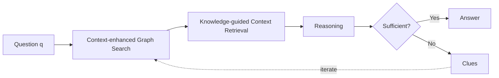

## Introduction

2025 년 10 월 말즈음부터 친구인 세옥이와 Agent 를 주제로 논문을 읽고 리뷰를 하고 있습니다. 벌써 3 달 즈음이 되어가는 것 같습니다. 당초 목표는 읽고 논리적인 글을 쓰는 것이었고, 그러다 논리적인 글의 좋은 예시는 논문이며 각자 Agent 에 관심이 있기 때문에 자유로운 방식으로 매주 논문 리뷰를 하려고 노력하고 있습니다. 저에게는 꾸준히 논문을 읽게 되는 것과 논문을 읽고 다시 정리해보는 연습이 되고 있습니다.

---

오늘의 주제는 Think on graph 2.0 라는 2025 년 ICLR 에 출품된 논문입니다. RAG 에 대한 접근법을 알려주고 있습니다.

> Retriever-Augmented Generation (RAG)
> **RAG**는 대규모 언어 모델 (LLM) 의 **응답을 생성하기 전에 외부 지식 소스에서 관련 정보를 검색하고, 그 정보를 LLM 의 입력에 포함해 답변을 만드는 기술**

RAG 가 왜 Agent 과 관련이 있을까요? 현시점에서 Agent 라고 함은 LLM 이 핵심 엔진으로 동작하면서 여러 도구를 다루고 피드백 루프를 통해서 목표를 수행하는 것을 말합니다. 이 때 Stateless 한 Language model 에게 부족한 지식을 보충하기 위한 도구로 RAG 가 대표적인 사례이기 때문에 RAG 가 Agent 와 관련 있다고 판단하였습니다.

## Background

![[20260111 Think-on-Graph.png]]

기존의 RAG 는 깊이 있는 탐색 또는 답변의 완전함에 대한 부족함이 문제가 발생하고 있었습니다.
Text-based RAG 는 semantic similarity 를 측정 할 수 있으나, 정보를 청크 단위로 저장하기 때문에 sturutural relationship 을 잡아내는데 어려움이 있고, Graph-based RAG 는 relationship 을 잡아낼 수 있으나 가져온 정보가 semantic 하게 유사한지 validate 를 하는데 어려움을 겪습니다.

이를 극복하기 위해서 KG + Text 접근 방식도 등장했으나 약하게 결합된 hybrid 방식은 여전히 복잡한 쿼리로 detail 한 정보를 가져오는 것에 어려움을 겪었습니다

따라서, 기존 RAG 접근 방식의 한계를 극복하기 위해서 좀 더 진보한 Hybrid 접근 방식인 Think-on-Graph 2 를 제안합니다.

- 기존의 RAG
  - Text based RAG
    - Effective for measuring semantic similarity
    - Unsuitable for multi-step reasoning or tracking logical links between information fragments
  - Knowledge graph based RAG
    - Effective for structuring high-level concepts and relationships
    - Suffers from inner incompleteness and lack of information beyond their Ontology
  - KG+Text RAG (Hybrid RAG)
    - **Loose coupling** combination still falls short in handling complex queries that require detailed information obtained through in-depth retrieval

## Methods : Think-on-Graph 2.0

> [!NOTE]+ TL;DR
> Think-on-graph 의 workflow
>
> 1. Context-enhanced Graph Search (후보를 확장해볼까?)
> 2. Knowledge-guided Context Retrieval (찾아낸 후보가 쓸모가 있는가?)
> 3. Reasoning (충분한 정보가 모였는가)

![[20260111 Think-on-Graph Workflow.png]]

ToG-2 은 Graph based 방식으로 관련 주제들을 찾아낸 후 Text based RAG 의 semantic 검색을 통해서 찾아낸 정보를 validation 을 하고, Language model 에게 iterate 여부를 결정함으로써 반복적으로 질의에 대한 퀄리티를 높이는 방식으로 작동하는 것입니다.

Context-enhanced Graph Search 단계에서 topic entity 를 시작으로 정해진 width $W$ 만큼 탐색을 합니다. 그 다음 찾아낸 정보들을 Pruning 을 하고, 마지막에 reasoning 단계에서 prompt 를 던져서 knowledge 가 충분한지 불충분한지 판단을 합니다.

> **Notation**
>
> - $\mathcal{E}^i_{topic} = \{e^i_1, e^i_2, …, e^i_j\}$: $i$ 번째 iteration 의 topic entities
> - $\mathcal{P}^{i-1} = \{P^{i-1}_1, P^{i-1}_2, …, P^{i-1}_j\}$: 이전까지의 triple paths
> - $P^{i-1}_j = \{p^0_j, p^1_j, …, p^{i-1}_j\}$: 여러 개의 triple 로 구성된 path
> - $p^{i-1}_j = (e^{i-1}_j, r^{i-1}_j, e^i_j)$: 두 entity 사이의 relation 을 나타내는 단일 triple
> - $W$: exploration width (각 iteration 에서 유지되는 topic entity 의 최대 수)
> - $j \in [1, W]$
> - $i = 0$ 일 때는 initialization phase 이며 $P^0$ 은 empty

각 iteration 에서 topic entity 들로부터 graph 를 탐색하고, 탐색 경로를 triple path 로 누적해 나갑니다. $W$ 개의 entity 를 유지하면서 너비 우선으로 확장합니다.

### Prune

#### Relation Prune

Graph Search 단계에서 각 topic entity 로부터 연결된 edge 들 중 질문과 관련 없는 relation 을 제거하는 단계입니다. LLM 에게 질문 $q$ 와 entity, 그리고 연결된 edge 들을 제공하여 관련 있는 relation 만 선택하도록 합니다.

> 1. 개별 entity 기준 pruning
>    $$PROMPT_{RP}(e^i_j, q, Edge(e^i_j))$$
> 2. combined 방식으로 여러 entity 의 edge 들을 한 번에 pruning
>    $$PROMPT_{RP\_cmb}(\mathcal{E}^i_{topic}, q, \{Edge(e^i_j)\}^W_{j=1})$$
>    $Edge(e^i_j)$: entity $e^i_j$ 에 연결된 모든 edge (relation) 들

#### Context Based Entity Prune

Relation Prune 을 통과한 candidate entity 들에 대해 Text-based semantic similarity 를 활용하여 최종 선별하는 단계입니다.

> **1. Chunk Relevance Score 계산**
> $$s^i_{j,m,z} = DRM(q, [triple\_sentence(Pc^i_{j,m}) : chunk^i_{j,m,z}])$$
>
> - $triple\_sentence(Pc^i_{j,m})$: KG 의 triple path 를 자연어 문장으로 변환
> - $chunk^i_{j,m,z}$: candidate entity 에 연결된 z 번째 text chunk
>
> **2. Entity Ranking Score 계산**
> $$score(c^i_{j,m}) = \sum_{k=1}^{K} s_k \cdot w_k \cdot \mathbb{I}(\text{k번째 chunk가 } c^i_{j,m} \text{에서 온 경우})$$
>
> - $w_k = e^{-\alpha \cdot k}$: 상위 랭크일수록 높은 가중치 부여
> - $\mathbb{I}$: indicator function (조건이 참이면 1, 거짓이면 0)
> - $K$, $\alpha$: hyperparameters

먼저 각 candidate entity 의 text chunk 들에 대해 DRM 으로 relevance score 를 계산합니다. 그 다음 모든 chunk 를 score 순으로 정렬하고, top-K chunk 중 해당 entity 에서 온 chunk 들의 점수를 exponential decay 가중치로 합산하여 최종 entity ranking score 를 구합니다. 이 score 가 높은 entity 들만 살아남습니다.

> **Dense Retrieval Model (DRM)** 이란?
> 텍스트를 dense vector (embedding) 로 변환하여 semantic similarity 를 측정하는 모델. Query 와 Document 를 각각 embedding 으로 변환한 뒤 cosine similarity 로 유사도를 계산한다.

### Reasoning

수집된 context 가 질문에 답하기에 충분한지 LLM 이 판단하는 단계입니다.

$$PROMPT_{rs}(q, \mathcal{P}^i, Ctx^i, Clues^{i-1}) = \begin{cases} Ans., & \text{if knowledge is sufficient} \\ Clues^i, & \text{otherwise} \end{cases}$$

- $q$: 원래 질문
- $\mathcal{P}^i$: 현재까지 탐색한 triple paths
- $Ctx^i$: 수집된 context (text chunks)
- $Clues^{i-1}$: 이전 iteration 에서 발견한 단서들

Knowledge 가 충분하면 **Answer** 를 생성하고, 불충분하면 **Clues** 를 생성하여 다음 iteration 의 탐색 방향을 안내합니다.

## Results

> **Benchmarks**
>
> - **WebQSP**: Freebase 기반 Knowledge Base QA. multi-hop reasoning 평가
> - **AdvHotpotQA**: HotpotQA 의 adversarial 버전. 더 어려운 multi-hop QA
> - **QALD-10-en**: Linked Data 기반 QA. 자연어 → SPARQL 쿼리 변환 평가
> - **FEVER**: Wikipedia 기반 Fact Verification. 주장의 참/거짓 검증
> - **Creak**: Commonsense Reasoning. 미묘한 상식 위반 판별
> - **Zero-Shot RE**: Zero-shot Relation Extraction. 학습 시 보지 못한 relation 추출
> - **ToG-FinQA**: Financial QA. 재무 보고서에서 수치/논리 추론

### Table 1. GPT-3.5-turbo 기준 성능 비교

| Baseline Type  | Method      | WebQSP (EM) | AdvHotpotQA (EM) | QALD-10-en (EM) | FEVER (Acc.) | Creak (Acc.) | Zero-Shot RE (EM) |
| -------------- | ----------- | ----------- | ---------------- | --------------- | ------------ | ------------ | ----------------- |
| LLM-only       | Direct      | 65.9%       | 23.1%            | 42.0%           | 51.8%        | 89.7%        | 27.7%             |
|                | CoT         | 59.9%       | 30.8%            | 42.9%           | 57.8%        | 90.1%        | 28.8%             |
|                | CoT-SC      | 61.1%       | 34.4%            | 45.3%           | 59.9%        | 90.8%        | 45.4%             |
| Text-based RAG | Vanilla RAG | 67.9%       | 23.7%            | 42.4%           | 53.8%        | 89.7%        | 29.5%             |
| KG-based RAG   | ToG         | 76.2%       | 26.3%            | 50.2%           | 52.7%        | **93.8%**    | 88.0%             |
| Hybrid RAG     | CoK         | 77.6%       | 35.4%            | 47.1%           | **63.5%**    | 90.4%        | 75.5%             |
| **Proposed**   | **ToG-2**   | **81.1%**   | **42.9%**        | **54.1%**       | 63.1%        | 93.5%        | **91.0%**         |

ToG-2 가 대부분의 데이터셋에서 가장 높은 성능을 보여줍니다. 특히 WebQSP, AdvHotpotQA, QALD-10-en, Zero-Shot RE 에서 최고 성능을 달성했습니다.

### Table 2. 다양한 Backbone Model 에서의 성능 비교

| Dataset     | Llama-3-8B Direct | Llama-3-8B ToG-2  | Qwen2-7B Direct | Qwen2-7B ToG-2    | GPT-3.5-turbo Direct | GPT-3.5-turbo ToG-2 | GPT-4o Direct | GPT-4o ToG-2      |
| ----------- | ----------------- | ----------------- | --------------- | ----------------- | -------------------- | ------------------- | ------------- | ----------------- |
| AdvHotpotQA | 20.8              | 34.7 (**66.8%↑**) | 17.9            | 30.8 (**72.1%↑**) | 23.1                 | 42.9 (**85.7%↑**)   | 47.7          | 53.3 (**11.3%↑**) |
| FEVER       | 35.5              | 52.9 (**49.0%↑**) | 38.6            | 53.1 (**38.1%↑**) | 51.8                 | 63.1 (**21.8%↑**)   | 66.2          | 70.1 (**5.9%↑**)  |
| ToG-FinQA   | 0                 | 8.2               | 0               | 10.3              | 0                    | 34.0                | 0             | 36.1              |

어떤 backbone model 을 사용하든 ToG-2 적용 시 성능이 크게 향상됩니다. 특히 작은 모델 (Llama-3-8B, Qwen2-7B) 에서 향상폭이 더 큽니다.

### Table 3. KG Completeness 에 따른 성능 변화

| KG Completeness (%) | Exploration Setting | EM (%) |
| ------------------- | ------------------- | ------ |
| 100                 | Default (W=3, D=3)  | 43     |
| 80                  | Default             | 41     |
| 50                  | Default             | 35     |
| 30                  | Default             | 23     |
| 30                  | Adjusted (W=8, D=2) | 29     |

KG 가 불완전해도 ToG-2 는 어느 정도 성능을 유지합니다. KG completeness 가 30% 로 떨어졌을 때 exploration setting 을 조정 (W=8, D=2) 하면 성능 저하를 완화할 수 있습니다.

## Appendix

