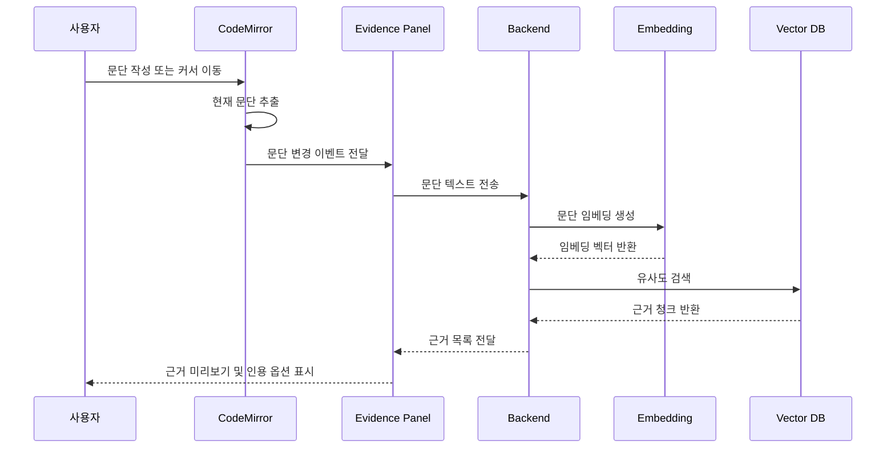
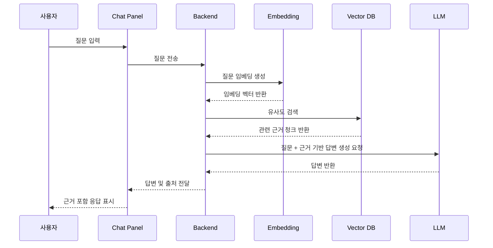

#### 과제 2. 과제 1 프로젝트 기반 블로그 콘텐츠
- 과제 1 프로젝트에 대한 **AI Agent 프로젝트 소개 글**을 블로그에 작성해주세요.
- 형식
	- 문제 정의, 해결 방안, 기대효과, 핵심 기술 항목은 필수적으로 기재해주세요.
	- 프로젝트를 One Page 로 볼 수 있는 대표 이미지를 1 장 필수로 첨부해주세요.
- 대상: 입문자도 따라할 수 있도록 친절한 설명을 포함하여 제작
## Upstage AI Ambassador 2기 1차 project Blog
## Introduction

안녕하세요. 이번에 대학원을 졸업한 고범수입니다.
저는 초보 연구자로서 논문을 처음 “제출 가능한 형태”로 끝까지 완주하는 과정에서, 글쓰기 자체보다 **근거를 확인하고 인용을 정리하는 과정에서 더 자주 흐름이 끊긴다**는 점을 체감했습니다.

논문은 주로 Overleaf 환경에서 작성했습니다. 하지만 10,000 자 이상으로 길어지는 논문 작성은 단순히 문장을 생산하는 작업이 아니라, **사고의 맥락과 인지적 에너지를 장기간 유지해야 하는 작업**에 가깝다고 느꼈습니다. 특히 졸업 논문 이후 컨퍼런스와 저널로 확장되는 과정에서, 출판물 포맷이 바뀔 때마다 동일한 논리를 유지한 채 구조와 톤을 재조정해야 했고, 이 과정이 반복적으로 부담으로 작용했습니다.

문헌이 추가되거나 제거될 때마다, 기존 주장과 인용이 여전히 유효한지 다시 확인해야 했고, 문서가 길어질수록 이러한 점검을 수동으로 수행하는 데 한계가 있음을 느꼈습니다. 이 경험을 통해, **에디터를 벗어나지 않고 근거를 확인하고 인용까지 이어갈 수 있는 방식**이 필요하다고 판단했습니다.

이번 과제를 계기로, 제가 가장 자주 사용하던 논문 작성 도구인 **Overleaf 를 포크 (fork)** 하여, Evidence Panel 기반 기능을 추가한 **My Awesome RA**를 구현했습니다.

<!-- 대표 이미지(필수): 프로젝트 One Page 요약 이미지 1장 첨부 -->

![[my-awesome-ra-onepage.png]]

## 1. 문제 정의

논문 작성 과정에서 인용할 근거를 찾고 검증하는 작업이 에디터 외부에서 이루어지면서 작성 흐름이 반복적으로 끊깁니다. 이로 인해 작성 중인 문단에 필요한 근거를 빠르게 특정하기 어렵고, PDF 뷰어·레퍼런스 도구·에디터 간 전환 과정에서 맥락이 소실됩니다. 결과적으로 근거와 주장 간의 연결이 약해지고, 인용 정확도와 문서 전반의 일관성이 저하되며, 문서가 길어질수록 수정과 확장에 필요한 비용이 급격히 증가합니다.

**요약하면 다음 세 가지 문제로 정리할 수 있습니다.**

- **작성 맥락 단절**: 에디터를 벗어난 근거 탐색과 잦은 컨텍스트 스위칭으로 사고 흐름이 반복적으로 끊깁니다.
- **근거–주장 연결 약화**: 인용이 실제로 어떤 근거를 뒷받침하는지 즉시 검증하기 어렵습니다.
- **확장 비용 증가**: 문서가 길어질수록 인용, 용어, 논리의 불일치를 수동으로 관리하기 어려워집니다.

**기존 방식의 한계는 다음과 같습니다.**

- Ctrl+F 기반 검색은 표현이 달라지면 원하는 근거를 찾기 어렵습니다.
- 근거 확인을 위해 여러 도구 (Zotero, Obsidian, Notion) 를 오가며 집중과 맥락이 쉽게 분산됩니다.
- 인용 형식은 맞출 수 있으나, 어떤 근거를 인용했는지에 대한 연결이 약해지기 쉽습니다.
- 문서가 길어질수록 전체 일관성을 수동으로 점검하는 인지적 비용이 급증합니다.
## 2. 해결 방안: My Awesome RA

Demo 에서는 오픈소스인 Latex 에디터 Overleaf Community editioun 내부에 **Evidence Panel**과 **Chat Panel**을 내장하여, “작성 (Write) → 근거 확인 (Verify) → 인용 (Insert)”을 **에디터 안에서 단일 플로우로 완결**시키는 AI 기반 RA(Research Assistant) 를 구성하였습니다.

핵심은 (1) 커서가 위치한 **현재 문단을 자동으로 컨텍스트로 삼아** 근거를 추천하는 Evidence Panel, (2) 참고문헌 (PDF 인덱스) 기반으로 **RAG Q&A**를 제공하는 Chat Panel 입니다.

## 3. 핵심 기능 및 동작 구조

본 시스템은 **Evidence Panel**과 **Chat Panel** 두 가지 기능 단위를 중심으로 구성되며, 두 기능은 동일한 문서 인덱스와 검색 파이프라인을 공유하되, 트리거와 사용자 인터랙션 목적이 명확히 분리되어 있습니다. 이를 통해 작성 흐름을 방해하지 않으면서도 근거 탐색과 검증을 병렬적으로 지원합니다.

### 3.1 Evidence Panel (문단 기반 자동 근거 추천)

Evidence Panel 은 사용자가 **현재 작성 중인 문단**을 명시적으로 질의하지 않아도, 에디터 상태를 컨텍스트로 삼아 자동으로 근거를 추천하는 기능입니다. 이는 “이 문장을 뒷받침할 근거가 있는가?”라는 질문을 **작성 시점에 선제적으로 해결**하는 데 목적이 있습니다.

기능적 특징은 다음과 같습니다.

- 현재 작성 중인 커서 위치 기준으로 현재 문단을 실시간 감지합니다.
- 해당 문단을 의미 단위로 임베딩하여 참고문헌 벡터 인덱스와 유사도 검색을 수행합니다.
- 관련도가 높은 근거 청크를 페이지 정보와 함께 Evidence Panel 에 즉시 표시합니다.
- 사용자는 클릭 한 번으로 PDF 내 해당 페이지를 확인하거나 인용을 삽입할 수 있습니다.

다음은 Evidence Panel 의 동작 로직입니다.

### 3.2 Chat Panel (근거 기반 대화형 질의응답)

Chat Panel 은 사용자의 **명시적 질문**을 입력으로 받아, 업로드된 참고문헌을 근거로 응답을 생성하는 대화형 기능입니다. Evidence Panel 이 “문단 중심 자동 추천”에 초점을 둔다면, Chat Panel 은 “의도 기반 탐색과 요약”에 초점을 둡니다.

기능적 특징은 다음과 같습니다.

- 사용자의 자연어 질문을 입력으로 받습니다.
- 질문을 임베딩하여 관련 참고문헌 청크를 검색합니다.
- 검색된 근거를 바탕으로 답변을 생성하며, 사용된 근거를 함께 제시합니다.
- 모든 응답은 출처가 명시되어 검증 가능한 형태로 제공됩니다.

다음은 Chat Panel 의 동작 로직입니다.

## 4. 기대 효과

이번 데모를 통해서 upstage 의 api 를 쓸 수 있었습니다. 제게는 평소에 생각만하던 기능을 구현해보고, [[Retriever-Augmented Generation (RAG)|RAG]] 를 직접적으로 구현해보고 임베딩 로직을 구성해보는 경험이 되었습니다. 기능 구현을 하면서 예상치 못한 에러들을 많이 겪었지만, 결과적으로 작동하는 데모가 구성이 되어 뿌듯합니다.

이 데모는 연구자가 논문을 작성하는 과정에서 발생하는 **근거 탐색, 검증, 인용 삽입의 반복 비용**을 구조적으로 감소시킬 것일아 기대합니다.

에디터 내부에서 현재 작성 중인 윛이 기준의 문단 단위 근거 추천과 자신이 참조한 논문에 대해서 질의응답이 동시에 제공됨으로써, 작성자는 검색과 검증에 소요되던 인지적·시간적 부담을 최소화하고, 논증의 정확성과 일관성에 더 집중할 수 있습니다. 또한 모든 추천과 응답이 명시적 근거에 기반하므로, AI 사용에 따른 신뢰성 문제를 완화하고 학술 글쓰기 맥락에 적합한 보조 도구로 기능할 수 있습니다. 나를 대신해주는 Researcher 보다는 내 능력을 증강시켜주는 Research assistant 인 것입니다

Upstage AI Ambassador 2기 1차 project Blog
## Introduction

안녕하세요. 이번에 대학원을 졸업한 고범수입니다.
저는 초보 연구자로서 논문을 처음 “제출 가능한 형태”로 끝까지 완주하는 과정에서, 글쓰기 자체보다 **근거를 확인하고 인용을 정리하는 과정에서 더 자주 흐름이 끊긴다**는 점을 체감했습니다.

논문은 주로 Overleaf 환경에서 작성했습니다. 하지만 10,000 자 이상으로 길어지는 논문 작성은 단순히 문장을 생산하는 작업이 아니라, **사고의 맥락과 인지적 에너지를 장기간 유지해야 하는 작업**에 가깝다고 느꼈습니다. 특히 졸업 논문 이후 컨퍼런스와 저널로 확장되는 과정에서, 출판물 포맷이 바뀔 때마다 동일한 논리를 유지한 채 구조와 톤을 재조정해야 했고, 이 과정이 반복적으로 부담으로 작용했습니다.

문헌이 추가되거나 제거될 때마다, 기존 주장과 인용이 여전히 유효한지 다시 확인해야 했고, 문서가 길어질수록 이러한 점검을 수동으로 수행하는 데 한계가 있음을 느꼈습니다. 이 경험을 통해, **에디터를 벗어나지 않고 근거를 확인하고 인용까지 이어갈 수 있는 방식**이 필요하다고 판단했습니다.

이번 과제를 계기로, 제가 가장 자주 사용하던 논문 작성 도구인 **Overleaf 를 포크 (fork)** 하여, Evidence Panel 기반 기능을 추가한 **My Awesome RA**를 구현했습니다.

<!-- 대표 이미지(필수): 프로젝트 One Page 요약 이미지 1장 첨부 -->

![[my-awesome-ra-onepage.png]]

## 1. 문제 정의

논문 작성 과정에서 인용할 근거를 찾고 검증하는 작업이 에디터 외부에서 이루어지면서 작성 흐름이 반복적으로 끊깁니다. 이로 인해 작성 중인 문단에 필요한 근거를 빠르게 특정하기 어렵고, PDF 뷰어·레퍼런스 도구·에디터 간 전환 과정에서 맥락이 소실됩니다. 결과적으로 근거와 주장 간의 연결이 약해지고, 인용 정확도와 문서 전반의 일관성이 저하되며, 문서가 길어질수록 수정과 확장에 필요한 비용이 급격히 증가합니다.

**요약하면 다음 세 가지 문제로 정리할 수 있습니다.**

- **작성 맥락 단절**: 에디터를 벗어난 근거 탐색과 잦은 컨텍스트 스위칭으로 사고 흐름이 반복적으로 끊깁니다.
- **근거–주장 연결 약화**: 인용이 실제로 어떤 근거를 뒷받침하는지 즉시 검증하기 어렵습니다.
- **확장 비용 증가**: 문서가 길어질수록 인용, 용어, 논리의 불일치를 수동으로 관리하기 어려워집니다.

**기존 방식의 한계는 다음과 같습니다.**

- Ctrl+F 기반 검색은 표현이 달라지면 원하는 근거를 찾기 어렵습니다.
- 근거 확인을 위해 여러 도구 (Zotero, Obsidian, Notion) 를 오가며 집중과 맥락이 쉽게 분산됩니다.
- 인용 형식은 맞출 수 있으나, 어떤 근거를 인용했는지에 대한 연결이 약해지기 쉽습니다.
- 문서가 길어질수록 전체 일관성을 수동으로 점검하는 인지적 비용이 급증합니다.
## 2. 해결 방안: My Awesome RA

Demo 에서는 오픈소스인 Latex 에디터 Overleaf Community editioun 내부에 **Evidence Panel**과 **Chat Panel**을 내장하여, “작성 (Write) → 근거 확인 (Verify) → 인용 (Insert)”을 **에디터 안에서 단일 플로우로 완결**시키는 AI 기반 RA(Research Assistant) 를 구성하였습니다.

핵심은 (1) 커서가 위치한 **현재 문단을 자동으로 컨텍스트로 삼아** 근거를 추천하는 Evidence Panel, (2) 참고문헌 (PDF 인덱스) 기반으로 **RAG Q&A**를 제공하는 Chat Panel 입니다.

## 3. 핵심 기능 및 동작 구조

본 시스템은 **Evidence Panel**과 **Chat Panel** 두 가지 기능 단위를 중심으로 구성되며, 두 기능은 동일한 문서 인덱스와 검색 파이프라인을 공유하되, 트리거와 사용자 인터랙션 목적이 명확히 분리되어 있습니다. 이를 통해 작성 흐름을 방해하지 않으면서도 근거 탐색과 검증을 병렬적으로 지원합니다.

### 3.1 Evidence Panel (문단 기반 자동 근거 추천)

Evidence Panel 은 사용자가 **현재 작성 중인 문단**을 명시적으로 질의하지 않아도, 에디터 상태를 컨텍스트로 삼아 자동으로 근거를 추천하는 기능입니다. 이는 “이 문장을 뒷받침할 근거가 있는가?”라는 질문을 **작성 시점에 선제적으로 해결**하는 데 목적이 있습니다.

기능적 특징은 다음과 같습니다.

- 현재 작성 중인 커서 위치 기준으로 현재 문단을 실시간 감지합니다.
- 해당 문단을 의미 단위로 임베딩하여 참고문헌 벡터 인덱스와 유사도 검색을 수행합니다.
- 관련도가 높은 근거 청크를 페이지 정보와 함께 Evidence Panel 에 즉시 표시합니다.
- 사용자는 클릭 한 번으로 PDF 내 해당 페이지를 확인하거나 인용을 삽입할 수 있습니다.

다음은 Evidence Panel 의 동작 로직입니다.

### 3.2 Chat Panel (근거 기반 대화형 질의응답)

Chat Panel 은 사용자의 **명시적 질문**을 입력으로 받아, 업로드된 참고문헌을 근거로 응답을 생성하는 대화형 기능입니다. Evidence Panel 이 “문단 중심 자동 추천”에 초점을 둔다면, Chat Panel 은 “의도 기반 탐색과 요약”에 초점을 둡니다.

기능적 특징은 다음과 같습니다.

- 사용자의 자연어 질문을 입력으로 받습니다.
- 질문을 임베딩하여 관련 참고문헌 청크를 검색합니다.
- 검색된 근거를 바탕으로 답변을 생성하며, 사용된 근거를 함께 제시합니다.
- 모든 응답은 출처가 명시되어 검증 가능한 형태로 제공됩니다.

다음은 Chat Panel 의 동작 로직입니다.

## 4. 기대 효과

이번 데모를 통해서 upstage 의 api 를 쓸 수 있었습니다. 제게는 평소에 생각만하던 기능을 구현해보고, [[Retriever-Augmented Generation (RAG)|RAG]] 를 직접적으로 구현해보고 임베딩 로직을 구성해보는 경험이 되었습니다. 기능 구현을 하면서 예상치 못한 에러들을 많이 겪었지만, 결과적으로 작동하는 데모가 구성이 되어 뿌듯합니다.

이 데모는 연구자가 논문을 작성하는 과정에서 발생하는 **근거 탐색, 검증, 인용 삽입의 반복 비용**을 구조적으로 감소시킬 것일아 기대합니다.

에디터 내부에서 현재 작성 중인 윛이 기준의 문단 단위 근거 추천과 자신이 참조한 논문에 대해서 질의응답이 동시에 제공됨으로써, 작성자는 검색과 검증에 소요되던 인지적·시간적 부담을 최소화하고, 논증의 정확성과 일관성에 더 집중할 수 있습니다. 또한 모든 추천과 응답이 명시적 근거에 기반하므로, AI 사용에 따른 신뢰성 문제를 완화하고 학술 글쓰기 맥락에 적합한 보조 도구로 기능할 수 있습니다. 나를 대신해주는 Researcher 보다는 내 능력을 증강시켜주는 Research assistant 인 것입니다