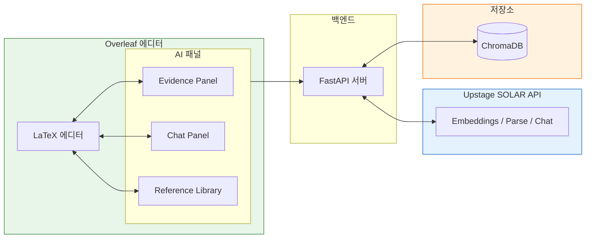
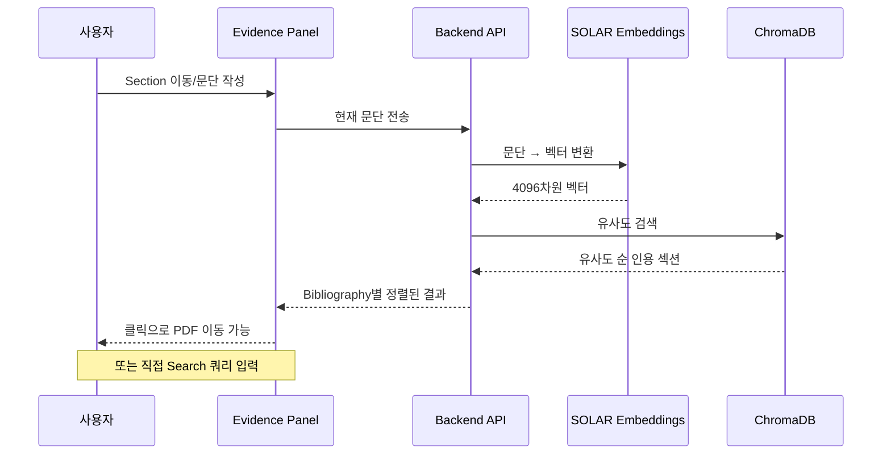
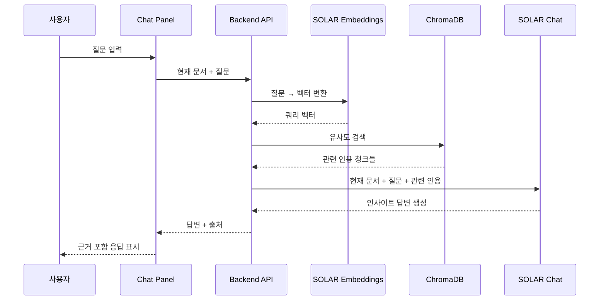

# My Awesome RA: AI-Powered Research Assistant for Evidence-Based Academic Writing

## Introduction

안녕하세요. 이번에 대학원을 졸업한 고범수입니다.
저는 초보 연구자로서 논문을 처음 “제출 가능한 형태”로 끝까지 완주하는 과정에서, 글쓰기 자체보다 **근거를 확인하고 인용을 정리하는 과정에서 더 자주 흐름이 끊긴다**는 점을 체감했습니다.

논문은 주로 Overleaf 환경에서 작성했습니다. 하지만 10,000 자 이상으로 길어지는 논문 작성은 단순히 문장을 생산하는 작업이 아니라, **사고의 맥락과 인지적 에너지를 장기간 유지해야 하는 작업**에 가깝다고 느꼈습니다. 특히 졸업 논문 이후 컨퍼런스와 저널로 확장되는 과정에서, 출판물 포맷이 바뀔 때마다 동일한 논리를 유지한 채 구조와 톤을 재조정해야 했고, 이 과정이 반복적으로 부담으로 작용했습니다.

문헌이 추가되거나 제거될 때마다, 기존 주장과 인용이 여전히 유효한지 다시 확인해야 했고, 문서가 길어질수록 이러한 점검을 수동으로 수행하는 데 한계가 있음을 느꼈습니다. 이 경험을 통해, **하나의 에디터 안에서 지속적으로 인용을 확인하고 관련 연구를 확인할 수 있는 방식**이 필요하다고 판단했습니다.

이번 과제를 계기로, 제가 가장 자주 사용하던 논문 작성 도구인 **Overleaf를 포크(fork)** 하여, AI 기반 참고문헌 관리 패널을 추가한 **My Awesome RA**를 구현했습니다.

### 프로젝트 요약 이미지

## 1. 문제 정의

논문 작성 과정에서 인용할 근거를 찾고 검증하는 작업이 에디터 외부에서 이루어지면서 작성 흐름이 반복적으로 끊깁니다. 이로 인해 작성 중인 문단에 필요한 근거를 빠르게 특정하기 어렵고, PDF 뷰어·레퍼런스 도구·에디터 간 전환 과정에서 맥락이 소실됩니다. 결과적으로 근거와 주장 간의 연결이 약해지고, 인용 정확도와 문서 전반의 일관성이 저하되며, 문서가 길어질수록 수정과 확장에 필요한 비용이 급격히 증가합니다.

**요약하면 다음 세 가지 문제로 정리할 수 있습니다.**

- **작성 맥락 단절**: 에디터를 벗어난 근거 탐색과 잦은 컨텍스트 스위칭으로 사고 흐름이 반복적으로 끊깁니다.
- **근거–주장 연결 약화**: 인용이 실제로 어떤 근거를 뒷받침하는지 즉시 검증하기 어렵습니다.
- **확장 비용 증가**: 문서가 길어질수록 인용, 용어, 논리의 불일치를 수동으로 관리하기 어려워집니다.

**기존 방식의 한계는 다음과 같습니다.**

- Ctrl+F 기반 검색은 표현이 달라지면 원하는 근거를 찾기 어렵습니다.
- 근거 확인을 위해 여러 도구 (Zotero, Obsidian, Notion) 를 오가며 집중과 맥락이 쉽게 분산됩니다.
- 인용 형식은 맞출 수 있으나, 어떤 근거를 인용했는지에 대한 연결이 약해지기 쉽습니다.
- 문서가 길어질수록 전체 일관성을 수동으로 점검하는 인지적 비용이 급증합니다.

## 2. 해결 방안: My Awesome RA

저는 오픈소스 LaTeX 에디터인 Overleaf Community Edition을 포크하여, **하나의 에디터 안에서 지속적으로 인용을 확인하고 관련 연구를 확인할 수 있도록** 구성했습니다.

세 가지 AI 패널을 추가했습니다: (1) **Evidence Panel** - 현재 작성 중인 문단을 자동으로 읽어서 관련 근거를 추천합니다. (2) **Chat Panel** - 참고문헌에 대해 직접 질문하고 답변을 받을 수 있습니다. (3) **Reference Library** - PDF를 업로드하고 관리하면 자동으로 검색 가능한 인덱스가 생성됩니다.

이를 통해 "문단 작성 → 근거 확인 → 질의응답 → 인용 삽입"까지 **에디터를 벗어나지 않고** 한 흐름으로 수행할 수 있습니다.

이 과정에서 Upstage의 SOLAR API를 세 가지 방식으로 활용했습니다.

### Upstage API 활용 방식

| API                | Endpoint                         | 용도                                        |
| ------------------ | -------------------------------- | ------------------------------------------- |
| **Embeddings**     | `/v1/solar/embeddings`           | 텍스트를 벡터로 변환 (문단/참고문헌 임베딩) |
| **Document Parse** | `/v1/document-ai/document-parse` | PDF에서 텍스트 추출 + 페이지 정보           |
| **Chat**           | `/v1/solar/chat/completions`     | 근거 기반 답변 생성                         |

**동작 흐름:** PDF 업로드 → Document Parse로 텍스트 추출 → Embeddings로 벡터화 → ChromaDB 저장 → 문단 작성 시 Embeddings로 검색 → Chat으로 답변 생성

## 3. 실제 사용 화면

실제로 어떻게 작동하는지 화면으로 보여드리겠습니다.

### 3.1 Evidence Panel: 자동으로 근거 찾아주기

논문을 쓰다가 현재 문단을 뒷받침할 근거가 필요한 순간, Evidence Panel은 에디터에서 선택된 문단(paragraph)을 기준으로 관련 논문의 섹션들을 유사도 순으로 자동으로 가져옵니다. 검색 결과는 bibliography 단위로 정리되며, 임베딩된 PDF에서 추출한 실제 섹션 내용을 함께 보여줍니다. 클릭 한 번으로 현재 작성 중인 section과 연관된 인용 근거를 확인하거나, 원본 PDF의 정확한 위치로 바로 이동할 수 있습니다.

또한 자동 추천뿐만 아니라, 사용자가 직접 query를 입력해 관련 논문을 찾아볼 수 있는 Search 기능도 제공합니다.

**작동 과정:**

Section을 이동하면 자동으로 유사도 순으로 정렬된 인용 섹션들이 불러와집니다. 각 결과를 클릭하면 해당 PDF의 정확한 위치로 이동할 수 있습니다.

**Reference Library 관리:**
Evidence Panel을 위해 **Reference Library**를 통해 참고문헌을 관리합니다. PDF 업로드, 인덱싱 상태 확인, 임베딩 시도가 가능하며, 업로드된 PDF는 Upstage Document Parse API를 통해 자동으로 인덱싱됩니다.

### 3.2 Chat Panel: 연구 보조자로서의 대화

Chat panel에서는 작성한 논문에 **직접 질문을 던져볼 수 있습니다.** Chat Panel은 현재 editor에 열려있는 문서와 사용자의 질의, 그리고 관련 인용을 토대로 답변을 생성합니다. 이를 통해 단순한 정보 검색을 넘어 **인사이트 도출** 등의 **연구 보조자로서의 역할**을 수행합니다.

**작동 과정:**

현재 작성 중인 문서의 맥락과 관련 인용을 함께 고려하여 답변을 생성하므로, "AI가 지어낸 답변"이 아니라 **실제 참고문헌에 기반한 연구 보조**가 가능합니다.

## 4. 기대 효과

평소 Overleaf로 논문을 쓰면서 “이런 기능이 있으면 좋겠다”고 생각만 하던 것을 직접 구현해볼 수 있어서 재밌었습니다. 특히 Overleaf에 원래 있던 것처럼 보이는 UI 패턴을 따라 새로운 기능을 자연스럽게 붙여보는 경험이 인상적이었습니다. 이번 데모를 통해 만든 이 도구의 기대 효과는 연구자를 대신하는 것이 아니라, 연구자가 연구에만 집중할 수 있도록 증강하는 것입니다. 근거를 찾고 확인하는 반복 작업은 AI가 맡고, 연구자는 논리 구성과 주장 발전에 더 많은 시간을 쓸 수 있도록 돕는 Research Assistant를 만드는 것이 목표였습니다. AI 시대에 연구의 방식과 역할 역시 변화하고 있으며 여전히 논쟁적인 지점도 존재하지만, 이번 데모는 그러한 흐름 속에서 나를 증강하는 도구가 어떤 모습일 수 있는지를 보여주는 하나의 사례가 될 수 있다고 생각합니다.
