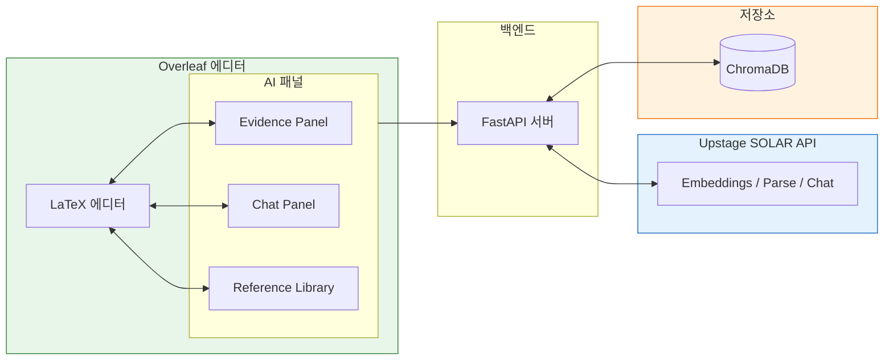
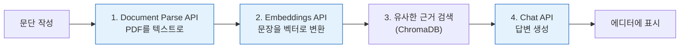

# My Awesome RA: AI-Powered Research Assistant for Evidence-Based Academic Writing

## Introduction

안녕하세요. 이번에 대학원을 졸업한 고범수입니다.
저는 초보 연구자로서 논문을 처음 “제출 가능한 형태”로 끝까지 완주하는 과정에서, 글쓰기 자체보다 **근거를 확인하고 인용을 정리하는 과정에서 더 자주 흐름이 끊긴다**는 점을 체감했습니다.

논문은 주로 Overleaf 환경에서 작성했습니다. 하지만 10,000 자 이상으로 길어지는 논문 작성은 단순히 문장을 생산하는 작업이 아니라, **사고의 맥락과 인지적 에너지를 장기간 유지해야 하는 작업**에 가깝다고 느꼈습니다. 특히 졸업 논문 이후 컨퍼런스와 저널로 확장되는 과정에서, 출판물 포맷이 바뀔 때마다 동일한 논리를 유지한 채 구조와 톤을 재조정해야 했고, 이 과정이 반복적으로 부담으로 작용했습니다.

문헌이 추가되거나 제거될 때마다, 기존 주장과 인용이 여전히 유효한지 다시 확인해야 했고, 문서가 길어질수록 이러한 점검을 수동으로 수행하는 데 한계가 있음을 느꼈습니다. 이 경험을 통해, **에디터를 벗어나지 않고 근거를 확인하고 인용까지 이어갈 수 있는 방식**이 필요하다고 판단했습니다.

이번 과제를 계기로, 제가 가장 자주 사용하던 논문 작성 도구인 **Overleaf 를 포크 (fork)** 하여, Evidence Panel 기반 기능을 추가한 **My Awesome RA**를 구현했습니다.

### 프로젝트 요약 이미지

## 1. 문제 정의

논문 작성 과정에서 인용할 근거를 찾고 검증하는 작업이 에디터 외부에서 이루어지면서 작성 흐름이 반복적으로 끊깁니다. 이로 인해 작성 중인 문단에 필요한 근거를 빠르게 특정하기 어렵고, PDF 뷰어·레퍼런스 도구·에디터 간 전환 과정에서 맥락이 소실됩니다. 결과적으로 근거와 주장 간의 연결이 약해지고, 인용 정확도와 문서 전반의 일관성이 저하되며, 문서가 길어질수록 수정과 확장에 필요한 비용이 급격히 증가합니다.

**요약하면 다음 세 가지 문제로 정리할 수 있습니다.**

- **작성 맥락 단절**: 에디터를 벗어난 근거 탐색과 잦은 컨텍스트 스위칭으로 사고 흐름이 반복적으로 끊깁니다.
- **근거–주장 연결 약화**: 인용이 실제로 어떤 근거를 뒷받침하는지 즉시 검증하기 어렵습니다.
- **확장 비용 증가**: 문서가 길어질수록 인용, 용어, 논리의 불일치를 수동으로 관리하기 어려워집니다.

**기존 방식의 한계는 다음과 같습니다.**

- Ctrl+F 기반 검색은 표현이 달라지면 원하는 근거를 찾기 어렵습니다.
- 근거 확인을 위해 여러 도구 (Zotero, Obsidian, Notion) 를 오가며 집중과 맥락이 쉽게 분산됩니다.
- 인용 형식은 맞출 수 있으나, 어떤 근거를 인용했는지에 대한 연결이 약해지기 쉽습니다.
- 문서가 길어질수록 전체 일관성을 수동으로 점검하는 인지적 비용이 급증합니다.
## 2. 해결 방안: My Awesome RA

저는 오픈소스 LaTeX 에디터인 Overleaf Community Edition을 포크하여, **Evidence Panel**과 **Chat Panel**을 추가했습니다. 이 두 패널은 "문단 작성 → 근거 확인 → 인용 삽입"을 **에디터 안에서 끝까지 완결**시킬 수 있도록 설계했습니다.

핵심 아이디어는 간단합니다. 제가 논문을 쓰면서 가장 불편했던 지점은 "이 문장을 뒷받침할 근거가 어디 있었지?"를 찾으러 여러 도구를 오가는 과정이었습니다. 그래서 (1) **현재 작성 중인 문단**을 자동으로 읽어서 관련 근거를 추천해주는 Evidence Panel과, (2) 궁금한 점을 **직접 질문**할 수 있는 Chat Panel을 만들었습니다.

이 과정에서 Upstage의 SOLAR API를 세 가지 방식으로 활용했습니다.

### Upstage API 활용 흐름

1. **Document Parse API**: 참고문헌 PDF를 업로드하면 텍스트로 변환합니다.
2. **Embeddings API**: 제가 작성한 문단과 참고문헌 내용을 숫자 벡터로 바꿔서 의미적으로 유사한 내용을 찾을 수 있게 합니다.
3. **Chat API**: 검색된 근거를 바탕으로 자연스러운 답변을 생성하거나, 제 질문에 답합니다.

## 3. 실제 사용 화면

실제로 어떻게 작동하는지 화면으로 보여드리겠습니다.

### 3.1 Evidence Panel: 자동으로 근거 찾아주기

제가 "Actor-Critic 방법은 정책 기반과 가치 기반 접근을 결합합니다"라는 문장을 쓰면, Evidence Panel이 **자동으로** 관련 참고문헌을 찾아서 오른쪽에 보여줍니다. 클릭 한 번으로 해당 PDF 페이지를 확인하거나, 바로 인용을 삽입할 수 있습니다.

제가 타이핑을 멈추면, 현재 문단이 Upstage Embeddings API를 거쳐 벡터로 변환되고, ChromaDB에서 가장 유사한 참고문헌 구절을 찾아냅니다. 이 과정이 1초 안에 끝나기 때문에, 작성 흐름이 끊기지 않았습니다.

### 3.2 Chat Panel: 직접 질문하기

"Actor-Critic의 장점이 뭐지?"처럼 **직접 질문**을 던질 수도 있습니다. Chat Panel은 제가 업로드한 참고문헌을 읽고 답변을 생성합니다. 중요한 건, **항상 출처를 함께 보여준다**는 점입니다.

제 질문도 Embeddings API를 거쳐서 관련 구절을 찾고, 그 구절들을 Upstage Chat API에 넣어서 답변을 만듭니다. 덕분에 "AI가 지어낸 답변"이 아니라, **제 참고문헌에 실제로 있는 내용**만 나옵니다.

### 3.3 Reference Library: 한곳에서 관리하기

참고문헌은 Reference Library에서 관리합니다. PDF를 업로드하면 Upstage Document Parse API가 텍스트를 추출하고, 자동으로 인덱싱됩니다.

## 4. 기대 효과

이번 프로젝트를 통해 평소에 생각만 하던 기능을 직접 구현해볼 수 있었습니다. Upstage의 세 가지 API (Document Parse, Embeddings, Chat) 를 조합해서 실제로 작동하는 RAG 시스템을 만드는 과정에서, API 응답 시간을 줄이는 법이나 벡터 검색 품질을 높이는 법 같은 실무 감각을 많이 배웠습니다. 예상치 못한 에러도 많았지만, 결과적으로 제가 원하던 "에디터 안에서 근거를 찾는" 경험을 구현할 수 있어서 뿌듯했습니다.

이 시스템의 핵심 가치는 **흐름을 끊지 않는다**는 점입니다. 기존에는 "이 주장을 뒷받침할 근거가 뭐였지?"라는 생각이 들 때마다 PDF 뷰어를 열고, Ctrl+F로 검색하고, 다시 에디터로 돌아오는 과정이 반복됐습니다. 이제는 그냥 타이핑만 하면, 오른쪽 패널에 관련 근거가 자동으로 뜹니다. 질문이 있으면 Chat Panel에 물어보면 됩니다.

또 하나 중요한 점은 **신뢰성**입니다. 일반적인 ChatGPT 같은 도구는 근거 없이 그럴듯한 답을 만들어낼 수 있지만, My Awesome RA는 **제가 업로드한 참고문헌에 실제로 있는 내용**만 보여줍니다. 모든 추천과 답변에 출처가 붙기 때문에, 논문 작성처럼 정확성이 중요한 상황에서도 안심하고 쓸 수 있습니다.

결국 이 도구는 저를 대신해주는 Researcher가 아니라, **제 능력을 증강시켜주는 Research Assistant**입니다. 근거를 찾는 단순 반복 작업은 AI에 맡기고, 저는 논리를 구성하고 주장을 다듬는 데 집중할 수 있게 됐습니다.