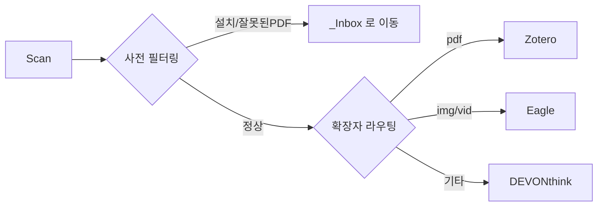
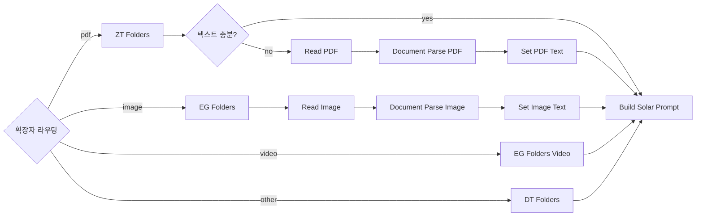

> [!tldr]
> Downloads, Documents, Desktop 에 쌓이는 파일을 n8n + Upstage API 로 자동 분류하여 Zotero (PDF), Eagle (이미지/영상), DEVONthink (기타) 에 임포트하는 No Code 워크플로우입니다.

## 해결한 문제

macOS 에서 파일을 다운로드하면 Downloads 폴더에 쌓입니다. PDF 는 Zotero 에, 스크린샷은 Eagle 에, 나머지는 DEVONthink 에 넣어야 하는데, 이 작업을 매번 수동으로 하면 두 가지 문제가 반복됩니다.

1. **파일명이 의미 없습니다** — `CleanShot 2026-03-26 at 17.57.45@2x.png`, `document(3).pdf` 같은 이름은 나중에 찾을 수 없습니다
2. **앱 선택이 번거롭습니다** — 파일마다 어떤 앱으로 보낼지 판단하고, 앱을 열고, 임포트해야 합니다

이 워크플로우는 Upstage Document Parse 로 파일 내용을 추출하고, Solar Pro 3 로 폴더와 파일명을 결정하여 두 문제를 자동으로 해결합니다. 10 분마다 실행되며 사용자 개입 없이 동작합니다.

## Motivation
Claude Code, OpenClaw 등 이미 강력한 자동화 도구가 있는 상황에서 n8n + Solar 조합만의 차별점은 **이벤트 트리거 기반 상시 자동화**에 있습니다. Claude Code 의 협업 모드(cowork)는 sandbox 환경이라 로컬 폴더에 직접 접근할 수 없고, OpenClaw 은 상시 데몬으로 운영하기에는 리소스 부담이 큽니다. 가장 단순한 상시 자동화 방법은 n8n 이라는 결론에 도달했습니다.

제가 겪는 문제는 Downloads, Documents, Desktop 에 파일이 쌓이는 것입니다. 주기적으로 정리하지 않으면 반복적으로 쌓이고 까먹게 되는 것들을 자동으로 정리해주기를 원했습니다. 이를 해결하기 위해 Upstage API (Document Parse + Solar Pro 3) 를 활용한 **로컬 파일 자동 분류 시스템**을 구성하였습니다. 파일이 생기면 내용을 분석하고 적절한 앱으로 자동 import 합니다.

전 Zotero, DEVONthink, Eagle 3 개의 프로그램을 주로 사용합니다. Zotero 는 PDF, Eagle 은 이미지와 영상 그리고 DEVONthink 는 이 외 나머지 파일들 webarchive 등을 저장하는 총괄 데이터베이스로 사용하고 있습니다.

| 앱          | 대상 파일    | Import 방식                                    |
| ---------- | -------- | -------------------------------------------- |
| Zotero     | PDF      | `zt import` / `zt create:item` + `zt attach` |
| Eagle      | 이미지, 동영상 | `eg import:path`                             |
| DEVONthink | 기타 문서    | `dt add`                                     |


전체 흐름은 Scan → Extract → Classify 입니다. Downloads, Documents, Desktop 에 쌓인 파일을 스캔하고, Upstage Document Parse 로 콘텐츠를 추출한 뒤, Solar Pro 3 가 폴더와 파일명을 결정합니다. 최종 임포트는 각 앱의 CLI 를 통해 수행합니다.

## 파일 분류 흐름

### 1 단계: 사전 필터링 + 앱 라우팅 (Stage & Categorize)

파이프라인의 게이트키퍼입니다. Solar API 호출 전에 불필요한 파일을 걸러냅니다. 숨김 파일, 빈 파일, 인스톨러는 skip 하거나 `_Inbox` 로 이동시키고, PDF 는 `%PDF-` 헤더를 검증하여 잘못된 파일을 걸러냅니다.

| 조건 | 처리 |
|------|------|
| 숨김/빈/임시 파일 | skip |
| 인스톨러 (`.dmg`, `.pkg`, `.app`, `.iso`) | `_Inbox` 로 이동 + skip |
| 잘못된 PDF (`%PDF-` 헤더 없음) | `_Inbox` 로 이동 + skip |

정상적으로 파일이 처리가 되는 경우 아래와 같이 진행됩니다.



1 회 실행 시 최대 12 개 파일을 처리하며, 그 중 PDF 는 4 개로 제한합니다. PDF 에 제한을 두는 이유는 Document Parse API 호출 비용과 시간 때문입니다. OCR 1 건당 최대 60 초 timeout 이 걸려 있어, PDF 가 많으면 전체 처리 시간이 길어집니다.

중복 처리에 대한 별도 관리는 하지 않습니다. 파이프라인이 끝나면 원본 파일이 삭제되거나 `_Inbox` 로 이동되므로, 다음 실행에서 같은 파일이 다시 잡히지 않습니다. 10 분 스케줄에 처리 시간이 1 분 이내이므로, 실행 간 겹칠 가능성도 구조적으로 없습니다.

또한 n8n 의 Switch 노드가 확장자별로 브랜치를 나누고, 각 브랜치 내에서는 순차 처리가 되므로 같은 앱에 동시 import 가 일어나지 않습니다. 즉, **n8n 의 브랜치 구조 자체가 앱별 큐 역할**을 합니다.

앱 선택은 확장자로 확정되며 Solar 가 변경하지 않습니다. Eagle, Zotero, DEVONthink 는 각각 처리하는 파일 유형이 정해져 있기 때문입니다.

#### 파일 안정성: Staging 이동

Stage & Categorize 는 파일 경로를 기록한 뒤 실제 처리까지 30~100 초가 소요됩니다. 이 사이에 외부 앱(CleanShot 등)이 파일을 rename 하거나 이동하면 ENOENT 오류가 발생합니다. 이를 방지하기 위해, 파일 발견 즉시 `~/.n8n-organizer/staging/` 디렉토리로 `fs.renameSync` (atomic move) 합니다.

- 모든 downstream 노드는 staging 경로(`filePath`)로 작업합니다
- 원본 경로는 `originalPath` 필드에 보존하여 로그에 기록합니다
- 파이프라인 크래시 대비: 매 실행 시작 시 staging 에 30 분 이상 머문 파일을 `_Inbox` 로 복원합니다

### 2 단계: App Extract

2 단계는 **폴더 목록 조회**와 **콘텐츠 추출** 두 하위 단계로 구성됩니다.

#### 2-1. 폴더 목록 조회

각 앱의 **실제 폴더/컬렉션 목록**을 CLI 로 가져옵니다. 30 분 TTL 캐시를 적용합니다. 여러 파일을 처리할 때 매번 폴더 트리를 가져오면 병목이 생기므로 캐시를 적용합니다. 10 분 스케줄에 30 분 TTL 이 적당합니다.

| 앱 | CLI 명령 | 파라미터 설명 | 출력 포맷 |
|-----|---------|-------------|----------|
| Zotero | `zt collections` | 전체 컬렉션 목록을 JSON 으로 반환합니다 | `ZK3ATEUT \| 00. Inbox` (key \| name) |
| Eagle | `eg folder:list` | 폴더 트리를 재귀적으로 JSON 으로 반환합니다 | `M8RRO78FRS1VZ \| Resources/Meme` (id \| path) |
| DEVONthink | `dt databases --property name` | 데이터베이스 목록을 name 필드만 반환합니다 | `[{"name": "01. Personal"}]` |
| | `dt groups --db "DB명" --property name` | 지정 DB 의 최상위 그룹을 name 필드만 반환합니다 | `[{"name": "00. Inbox"}, ...]` |
| | `dt groups --db "DB명" "/그룹명" --property name` | 하위 그룹을 name 필드만 반환합니다 | `[{"name": "창업"}, ...]` |

#### 2-2. 콘텐츠 추출

콘텐츠 추출은 확장자에 따라 분기됩니다. PDF 와 이미지는 n8n 의 **HTTP Request 노드**를 통해 Upstage Document Parse API 를 명시적으로 호출하므로, 워크플로우 UI 에서 데이터 흐름을 직접 확인할 수 있습니다. 기존에 Code 노드 안에 숨겨두었던 curl 호출을 HTTP Request 노드로 전환한 것입니다.

- **PDF**: mdls (Spotlight) 로 텍스트 추출 → 300 자 미만이면 Upstage Document Parse API (`HTTP Request` 노드) 로 OCR 수행
- **이미지**: Upstage Document Parse API (`HTTP Request` 노드) 로 텍스트 추출
- **동영상**: 콘텐츠 추출 없이 파일명 기반으로 바로 Solar 분류 단계로 진행
- **기타**: 파일명 기반

동영상은 Document Parse 로 분석할 수 없으므로 폴더 목록만 조회한 뒤 파일명 기반으로 Solar 에 전달합니다.



### 3 단계: Solar Pro 3 폴더 분류 + 파일명 생성

추출된 텍스트 + 파일명 + 해당 앱의 폴더 목록을 Solar Pro 3 에 전달합니다. Solar 는 1 단계에서 확정된 앱은 변경하지 않으며, 폴더 선택과 파일명 생성만 담당합니다:

```json
{
  "document_type": "academic_paper",
  "target_folder": "ZK3ATEUT",
  "new_filename": "2026-03-25_AI_기반_정보_자동_분류.pdf",
  "rating": 8,
  "criteria": {
    "folder_match": 9,
    "filename_quality": 7,
    "content_understanding": 8
  },
  "feedback": "AI 관련 학술 자료로 Zotero 컬렉션에 적합",
  "language": "ko"
}
```

초기 구현에서의 단일 `confidence` 점수는 비보정 상태로 의미가 없었습니다 (잘못 분류해도 0.95 반환). 이를 **다기준 평가 체계**로 대체했습니다:

| 기준 | 설명 |
|------|------|
| `folder_match` | 선택한 폴더가 파일 내용에 적합한지 (1-10) |
| `filename_quality` | 생성된 파일명이 내용을 잘 설명하는지 (1-10) |
| `content_understanding` | 파일 내용을 얼마나 정확히 이해했는지 (1-10) |

종합 `rating` 점수에 따라 파이프라인이 분기합니다:

| rating | 처리 |
|--------|------|
| 9-10 | 정상 import + 고신뢰 알림 |
| 6-8 | 정상 import |
| 1-5 | Inbox fallback (수동 확인 필요) |

`reasoning_effort` 파라미터를 파일 유형별로 차등 적용합니다. PDF 와 이미지는 `high` (깊은 추론 필요), 동영상과 기타 파일은 `medium` (파일명 기반 단순 분류) 으로 설정합니다.

Solar 의 JSON 응답은 `Parse Solar Response` 노드 내부에서 **양방향 lookup map** 으로 검증됩니다. key 또는 name 어느 쪽으로 응답해도 정규화하며, 일치하지 않으면 Fallback 폴더로 대체합니다.

| 앱 | Fallback 위치 | 포맷 |
|-----|-----------|------|
| Zotero | `00. Inbox` | key: `8UZJ5THD` |
| Eagle | root | folderId 생략 |
| DEVONthink | `/00. Inbox` | group path |

> [!important] 다기준 평가로 검증
> 단일 confidence 대신 folder_match, filename_quality, content_understanding 3 개 축으로 평가합니다. 종합 rating 6 점 미만은 자동으로 Inbox fallback 되며, 세부 점수와 한국어 피드백이 로그에 기록됩니다.

### 4 단계: 임포트 (Import)

Import Router 가 `targetApp` 값에 따라 세 갈래로 분기합니다. 세 경로 모두 `pgrep` 으로 앱 실행 여부를 확인하고, 꺼져 있으면 `open -a` 로 자동 실행한 뒤 임포트를 수행합니다.

| 앱 | CLI 명령 | 파라미터 설명 | 특이사항 |
|-----|---------|-------------|---------|
| Zotero | `zt import FILE --collection COL` | `FILE`: 임포트할 파일 경로, `--collection`: 대상 컬렉션 key | 실패 시 `zt create:item --type document --title TITLE --collection COL` + `zt attach FILE --key KEY` 2 단계 fallback |
| Eagle | `eg import:path --path FILE --name NAME --folderId FID` | `--path`: 파일 경로, `--name`: 표시 이름, `--folderId`: 대상 폴더 ID | 파일명에서 따옴표 제거 후 `--name` 에 전달 |
| DEVONthink | `dt add FILE --db "01. Personal" --at PATH --name NAME` | `FILE`: 파일 경로, `--db`: 대상 DB, `--at`: 그룹 경로, `--name`: 표시 이름 | 고정 DB `01. Personal` 사용 |

### 5 단계: 후처리 (Cleanup & Logging)

임포트 성공 여부에 따라 분기합니다.

| 결과 | 동작 |
|------|------|
| 성공 | 원본 파일 삭제 |
| 실패 | 원본을 `~/Downloads/_Inbox/` 로 이동 |

두 경우 모두 `~/.n8n-organizer/log.jsonl` 에 JSON 로그를 추가하고, macOS 알림 (`osascript`) 을 표시합니다.


## Upstage API 활용

### Document Parse (endpoint: `document-digitization`, model: `document-parse`)

| 대상 | 모드 | 용도 |
|------|------|------|
| PDF (mdls 300 자 미만 시) | `document-parse`, `ocr=auto` | 스캔 PDF 텍스트 추출 |
| 이미지 (스크린샷/차트) | `document-parse`, `ocr=auto` | 화면 내 텍스트/다이어그램 설명 |
| 일반 사진 | `document-parse`, `ocr=auto` | **한계**: 풍경/인물/음식 분석 불가 |

### Solar Pro 3 (`chat/completions`)

- Text-only 모델 (102B MoE)
- Document Parse 가 추출한 텍스트를 기반으로 파일명 + 폴더 결정
- 이미지 직접 분석 불가 → Document Parse 의 텍스트 출력에 의존
- `reasoning_effort` 파라미터: PDF/이미지 → `high`, 동영상/기타 → `medium`
- 다기준 평가 JSON 스키마 반환: `rating` (종합 점수) + `criteria` (folder_match, filename_quality, content_understanding) + `feedback` (한국어 피드백)

## 노드 구성 (v5, 33 nodes)

| 유형 | 개수 | 역할 |
|------|------|------|
| Schedule/Manual Trigger | 2 | 10 분 스케줄, 수동 테스트 |
| Code | 6 | Stage & Categorize, ZT Folders, EG Folders, EG Folders Video, DT Folders, Parse Solar Response |
| Execute Command | 7 | CLI 임포트 (Zotero/Eagle/DEVONthink), 파일 정리, 알림, 로그 기록 |
| Set | 8 | 프롬프트 조립, Fallback 데이터, 임포트 결과 매핑 (3), 로그 준비, PDF/이미지 텍스트 설정 (2) |
| HTTP Request | 3 | Solar Pro 3 API 호출, Document Parse PDF, Document Parse Image |
| ReadWriteFile | 2 | Read PDF, Read Image |
| Switch | 2 | 확장자 라우팅, 앱별 라우팅 |
| If | 3 | Solar Response Success?, Import Success?, PDF Text OK? |

### 장애 내성 (Fault Tolerance)

대부분의 IO 노드에 `continueOnFail` 이 설정되어 있어, 개별 파일 처리 실패가 전체 파이프라인을 중단시키지 않습니다. Import 노드는 실행 전 `[ ! -f "$FP" ]` 로 파일 존재를 확인하며, Solar 응답 파싱 실패 시 마크다운 코드블록 제거 후 재시도합니다. 콘텐츠 텍스트는 4,000 자로 truncation 하여 Solar 의 컨텍스트 윈도우 초과를 방지합니다.

## 마이그레이션: Code 노드 최소화

초기 워크플로우는 Code 노드 10 개에 400 줄 이상의 JavaScript 가 있었습니다. Code 노드는 n8n UI 에서 데이터 흐름을 추적하기 어렵습니다. " 확실한 것만 " 원칙으로 4 개 Code 노드를 네이티브 노드로 전환했습니다.

| 대상 | Before | After |
|------|--------|-------|
| Fallback Solar Response | Code (40 줄) | **Set 노드** |
| Import to Zotero | Code (65 줄) | **Execute Command + Set** |
| Import to Eagle | Code (40 줄) | **Execute Command + Set** |
| Import to DEVONthink | Code (40 줄) | **Execute Command + Set** |

**겪은 문제:**
1. **CLI stdout 이 "OK" 마커를 가림** — `dt add` 등 CLI 도구가 JSON 을 stdout 에 출력 → `>/dev/null` 추가로 해결
2. **ReadWriteFile binary 오류** — Append Log 노드를 Execute Command heredoc 으로 교체
3. **중복 처리 우려** — 처리 완료 시 원본 삭제/이동으로 구조적으로 회피. 해시 관리 불필요

## Operational Tips

PM2 를 사용하여 n8n 프로세스를 상시 운영합니다. `ecosystem.config.js` 에서 `autorestart: true` 로 크래시 시 자동 재시작하고, `max_memory_restart: '512M'` 으로 메모리 초과 시에도 자동 복구합니다. 실행 명령은 아래와 같습니다.

```bash
# 시작
pm2 start ecosystem.config.js

# 상태 확인
pm2 status n8n-organizer

# 로그 확인
pm2 logs n8n-organizer --lines 50
```

### 설정 파일

| 경로 | 용도 |
|------|------|
| `~/.n8n-organizer/zt-token` | Zotero CLI 토큰 |
| `~/.n8n-organizer/folder-choices-cache.json` | 폴더 목록 캐시 (30 분 TTL) |
| `~/.n8n-organizer/log.jsonl` | 처리 로그 (JSONL) |
| `~/.n8n-organizer/staging/` | 처리 중 파일 임시 저장 (atomic move) |

### 한계 및 향후 개선
- 일반 사진 naming — vision API 없이는 파일명 기반이 한계입니다. 향후 Claude Haiku Vision 등을 검토할 예정입니다
- rating 임계값 조정 — 현재 6점 기준은 초기값이며, 로그 분석을 통해 조정이 필요합니다
- CLI 도구 문서화 — `zt` (zotero-cli), `eg` (eagle-cli), `dt` (devonthink-cli) 는 직접 개발한 도구입니다. 파라미터 설명과 사용 예시가 부족하여 `--help` 출력 개선 및 README 작성이 필요합니다