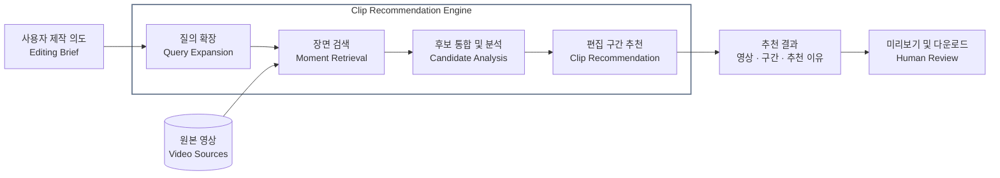

## 문제 정의

자연어로 영상 속 장면을 찾는 서비스를 만들다 보면 다음 질문이 나옵니다.

> 여러 소스 영상에서 원하는 장면을 찾는 것을 넘어, 편집점 자체를 추천할 수는 없을까?
> 예를 들어 만들고 싶은 영상을 설명하면 사용할 만한 장면을 추천하는 기능이다.

가능합니다. 다만 장면 검색을 대체하는 새 기능이 아니라 장면 검색을 확장하는 형태로 가야 하며, 문제를 세밀하게 나눠 볼 필요가 있습니다.

이 질문을 시스템으로 정리하면 다음과 같습니다.

> 영상 제작 의도를 자연어로 입력받아 관련된 소스 구간을 탐색하고, 편집 활용도를 고려해 후보 클립과 시작·종료 시점을 제안하는 시스템.

입력은 구체적인 장면 묘사가 아니라 **제작 의도**입니다. 출력은 관련 구간 목록이 아니라 **편집에 쓸 후보 클립과 시작·종료 시점**입니다. 그 사이에는 관련 있는 장면과 실제로 쓸 만한 장면을 가르는 **편집 활용도** 판단이 있습니다.

따라서 기술 주제를 고르기 전에 두 가지를 먼저 정해야 합니다. 하나는 문제에 쓰인 단어, 특히 편집점이 무엇을 뜻하는지입니다. 다른 하나는 검색과 추천이 어디서 갈리는지입니다.

## 편집점의 정의

편집점을 추천하려면 먼저 편집점이 무엇인지 정해야 합니다.

- **편집점 (Edit Point)**
	- 영상 편집 과정에서 클립이 시작되거나 끝나는 경계입니다.
	- 특히 편집 타임라인에서 두 클립이 연결되는 지점입니다.
- **구분해야 할 세 가지 개념**
	- Edit Point
		- 타임라인에서 클립 사이의 컷 또는 전환 지점입니다.
		- 예를 들어 A 영상에서 B 영상으로 넘어가는 시점입니다.
	- IN/OUT Point
		- 원본 영상에서 사용할 구간의 시작과 끝입니다.
		- 예를 들어 원본의 10 초~18 초를 사용합니다.
	- Shot Boundary
		- 원본 영상 자체에서 샷이 전환되는 지점입니다.
		- 예를 들어 카메라 화면이 다른 장면으로 바뀌는 시점입니다.

세 개념을 구분하면 이 시스템이 무엇을 반환하는지 정해집니다.

- **직접 출력은 IN/OUT Point 다.**
	- 시스템은 원본 영상에서 어디부터 어디까지 쓸지 제안합니다.
- **Edit Point 는 이번 범위 밖이다.**
	- 추천된 클립을 타임라인에서 어떤 순서로 이어 붙일지는 편집 조립 (sequencing) 의 문제입니다.
- **Shot Boundary 는 경계를 보정하는 단서다.**
	- 샷이 바뀌는 지점이 곧 좋은 IN/OUT 은 아닙니다.
	- 다만 후보 구간의 시작·끝을 다듬는 데 활용할 수 있습니다.

그래서 엄밀히 말하면 이 시스템이 추천하는 것은 편집점이 아니라 **편집에 쓸 IN/OUT 구간**입니다. 이 구분을 해 두어야 타임라인 조립까지 한꺼번에 풀려는 범위 확장을 막을 수 있습니다.

## 검색과 추천의 구분

장면 검색과 편집 구간 추천은 모두 영상의 시간 구간을 반환합니다. 하지만 시스템이 맡는 판단은 다릅니다.

- **검색은 관련 구간을 발견한다.**
	- 사용자는 원하는 장면을 이미 알고 있습니다.
	- 예: " 사람이 장애물을 넘는 장면을 찾아줘."
	- 시스템은 그 장면이 어디에 있는지만 답하면 됩니다.
- **추천은 사용할 구간을 선택한다.**
	- 사용자는 만들고 싶은 영상의 의도만 알고 있습니다.
	- 예: " 강인함이 드러나는 영상을 만들고 싶어."
	- 시스템은 어떤 장면이 의도에 맞는지, 그 장면을 어디부터 어디까지 쓸지까지 판단해야 합니다.

추천은 검색 결과를 친절하게 보여주는 기능이 아닙니다. 검색 위에 의도 해석과 선택 판단이 얹힌 기능입니다. 그래서 추천을 만들려면 검색을 버리는 것이 아니라 검색을 확장해야 합니다.

## 문제 분해와 연결되는 기술 주제

문제 정의 문장을 단어 단위로 나누면 각 단어가 하나의 기술 주제와 이어집니다.

| 문제 정의의 단어 | 풀어야 하는 질문 | 연결되는 기술 주제 |
|---|---|---|
| 영상 제작 의도 | 추상적인 의도를 검색 가능한 장면 묘사로 어떻게 바꿀까? | Query Expansion |
| 관련된 소스 구간 탐색 | 여러 영상 중 어디에 관련 장면이 있을까? | Moment Retrieval, Video Corpus Moment Retrieval |
| 편집 활용도 | 관련 있는 장면 중 실제로 쓸 만한 것은 무엇일까? | Clip Recommendation, Highlight Detection |
| 후보 클립 | 여러 검색 결과를 어떻게 합치고 순위를 매길까? | Candidate Fusion, Re-ranking |
| 시작·종료 시점 | 편집에 쓸 IN/OUT 을 어디로 잡을까? | Temporal Grounding, Shot Boundary Detection |

이 가운데 중심이 되는 주제는 두 가지입니다.

- **Moment Retrieval**
	- 영상에서 어떤 장면이 어디에 있는가?
	- [Localizing Moments in Video with Natural Language](https://arxiv.org/abs/1708.01641) 는 자연어 설명으로 영상의 특정 시간 구간을 찾는 문제를 다룹니다.
	- 여러 영상에서 구간을 찾아야 한다면 [TVR](https://arxiv.org/abs/2001.09099) 처럼 영상 집합 전체를 대상으로 한 moment retrieval 로 범위가 넓어집니다.
- **Clip Recommendation**
	- 제작 목적에 비추어 어떤 구간을 사용하는 것이 좋은가?
	- [QVHighlights](https://arxiv.org/abs/2107.09609) 는 질의에 관련된 구간과 함께 구간별 saliency 를 예측합니다.
	- 관련성과 별개로 더 쓸 만한 구간을 고른다는 점에서 편집 활용도 판단과 맞닿아 있습니다.

나머지 주제는 두 주제를 잇는 역할을 합니다. Query Expansion 은 제작 의도를 검색 가능한 형태로 바꾸고, Shot Boundary Detection 은 추천된 구간의 경계를 다듬습니다.

## 아키텍처

직관적인 방법 중 하나는 쿼리를 증강하는 것입니다. 사용자의 제작 의도를 여러 검색 질의로 확장하고, 검색된 후보를 통합·분석한 뒤 편집에 쓸 구간을 추천합니다. 각 단계는 앞에서 분해한 문제를 하나씩 맡습니다.

- **Query Expansion**
	- 제작 의도를 여러 개의 구체적인 장면 묘사로 펼칩니다.
	- 단일 질의보다 다양한 후보를 발견하기 위한 확장 전략입니다.
	- [Query2doc](https://aclanthology.org/2023.emnlp-main.585/) 은 LLM 으로 질의를 확장해 검색을 돕는 접근입니다.
- **Moment Retrieval**
	- 확장된 각 질의로 원본 영상에서 관련 구간을 찾습니다.
	- 이 단계는 기존 장면 검색 구현을 그대로 재사용할 수 있습니다.
- **Candidate Analysis**
	- 여러 질의에서 나온 후보를 합치고 중복 구간을 정리합니다.
	- 각 후보에 실제로 무엇이 보이는지 확인합니다.
- **Clip Recommendation**
	- 제작 의도에 비추어 후보의 순위를 매기고 추천 이유를 남깁니다.
	- 선택한 후보의 IN/OUT 을 제안하고, 필요하면 Shot Boundary 로 경계를 보정합니다.
- **Human Review**
	- 최종 선택은 편집자가 합니다.
	- 미리보기와 다운로드는 추천을 빠르게 검증하고 편집 도구로 가져가기 위한 단계입니다.

여기서 논리적 모듈은 별도 모델을 뜻하지 않습니다. Gemini 한 번의 호출로 후보 분석과 추천을 함께 수행할 수도 있습니다. 모듈을 나눌지는 구현 선택이고, 나눠서 얻는 이득은 검증으로 확인해야 합니다.

여러 영상을 다뤄야 한다면 [TwelveLabs Marengo](https://playground.twelvelabs.io/) 같은 Video Retrieval API 도 살펴볼 만합니다. 여러 영상을 인덱싱하고 개별 클립 단위로 결과를 받을 수 있습니다.

## 검증

검색과 추천은 평가 방식도 다릅니다. 검색에는 정답 구간이 있지만, 추천에는 정답이 하나로 정해지지 않을 수 있습니다.

- **장면 검색**
	- 사람이 표시한 정답 구간과 비교합니다.
	- IoU, 경계 오차, 없는 장면을 지어내는지를 확인합니다.
- **편집 구간 추천**
	- 편집자가 추천 후보를 실제로 채택하는 비율을 봅니다.
	- 채택한 후보의 IN/OUT 을 얼마나 고쳤는지 기록합니다.
	- 거절한 후보는 이유를 남깁니다.
- **아키텍처 선택**
	- 같은 영상과 같은 모델로, 질의 확장과 후보 분석이 있는 경우와 없는 경우를 비교합니다.
	- 차이가 없다면 단계를 늘리지 않는 편이 낫습니다.

추천 이유는 모델이 쓴 설명일 뿐이므로 그 자체를 정확성의 근거로 삼지 않습니다. 추천이 탐색 시간을 줄였다고 말하려면 추천 없이 직접 찾는 경우와 비교해야 합니다.

## References

### Github

- [songheon2/vid-moment-search](https://github.com/songheon2/vid-moment-search/tree/51688673c59606a539fde55e30cafbeaed5fcaca)
	- 로컬 영상과 자연어 질의로 장면의 타임코드를 찾고, Gemini 와 TwelveLabs 를 같은 테스트셋에서 비교하는 실험 도구입니다.
- [junha22/vlm-video-search](https://github.com/junha22/vlm-video-search/blob/94e3c5aa6feb48380f9b5bc9abdcafbec37a940a/app.py)
	- Streamlit 에서 영상과 장면 묘사를 입력받아 Gemini 로 시간 구간을 찾는 웹 구현입니다.
- [jayleicn/moment_detr](https://github.com/jayleicn/moment_detr)
	- QVHighlights 데이터셋과 Moment-DETR 코드 저장소입니다.
- [ssrajadh/sentrysearch](https://github.com/ssrajadh/sentrysearch)
	- 영상 의미 검색, VLM 재정렬, 클립 추출까지 구현해 기술적으로 관련성이 높습니다.
- Shorts 생성 도구
	- 바이럴 요소가 있지만 핵심 로직은 유사해 서비스 형태를 참고할 수 있습니다.
	- [mutonby/openshorts](https://github.com/mutonby/openshorts)
	- [FujiwaraChoki/supoclip](https://github.com/FujiwaraChoki/supoclip)
	- [jipraks/yt-short-clipper](https://github.com/jipraks/yt-short-clipper)

### 논문

- [Localizing Moments in Video with Natural Language](https://arxiv.org/abs/1708.01641)
- [TVR: A Large-Scale Dataset for Video-Subtitle Moment Retrieval](https://arxiv.org/abs/2001.09099)
- [TransNet V2: An effective deep network architecture for fast shot transition detection](https://arxiv.org/abs/2008.04838)
- [Detecting Moments and Highlights in Videos via Natural Language Queries](https://proceedings.neurips.cc/paper_files/paper/2021/hash/62e0973455fd26eb03e91d5741a4a3bb-Abstract.html)
- [Query-Dependent Video Representation for Moment Retrieval and Highlight Detection](https://openaccess.thecvf.com/content/CVPR2023/html/Moon_Query-Dependent_Video_Representation_for_Moment_Retrieval_and_Highlight_Detection_CVPR_2023_paper.html)
- [UniVTG: Towards Unified Video-Language Temporal Grounding](https://openaccess.thecvf.com/content/ICCV2023/html/Lin_UniVTG_Towards_Unified_Video-Language_Temporal_Grounding_ICCV_2023_paper.html)
- [VTimeLLM: Empower LLM to Grasp Video Moments](https://openaccess.thecvf.com/content/CVPR2024/html/Huang_VTimeLLM_Empower_LLM_to_Grasp_Video_Moments_CVPR_2024_paper.html)
- [Query2doc: Query Expansion with Large Language Models](https://aclanthology.org/2023.emnlp-main.585/)

### 유사 서비스

- [Search media using AI in Premiere](https://helpx.adobe.com/premiere/desktop/organize-media/file-organization/search-for-media-using-ai-powered-media-intelligence.html)
- [ClipAnything](https://www.opus.pro/clipanything)
	- 프롬프트로 영상 속 원하는 순간을 클립으로 만드는 서비스입니다.
