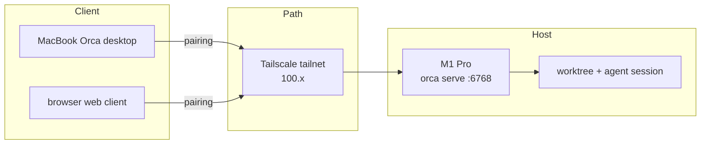

# Spinning Up a Dev Server with Orca Serve Frees Me from the Laptop

> [!abstract] TL;DR
> Attach a development server with `orca serve` and the session lives on the server. Closing the laptop does not stop the work.

After founding Senior AI Lab I started going to Seoul often. The work lives elsewhere and my body keeps moving. Every trip came as a set: MacBook left always on, a fat power bank, a hotspot. One laptop carried the repo, the agent session, and the local server. The moment I close the bag, the running loop folds with it.

On 2026-08-16 I wrote the conclusion down. Stop developing on the MacBook. Distribute the development location and mitigate the risk that comes from moving. The means is Orca.

Today I saw that Orca's `serve` supports exactly this. So I attached my development servers. At first I worried about the connection. Once pairing worked, a safe path opened. The delay is smaller than I expected, and it is stable. The session stays up on the server, so I can close the laptop and leave. The work keeps going. What I needed was a development location separated from travel.

## What `orca serve` creates is a Dev Server

`serve` starts the runtime without the desktop app. Set a port and a pairing address, and that machine becomes the server the agent lives on.

```bash
orca serve --port 6768 --pairing-address <tailscale-ip>
```

The client can be the Orca desktop, or a web client on the same port. One pairing code and the remote runtime is saved as an environment. From then on, `orca status` and `orca worktree ps` point at that host.

The M1 Pro I checked today was exactly that picture.

- The runtime is ready. The desktop app is off
- A Claude Code agent is already working on a worktree
- The laptop's local Orca is a separate runtime. The real loop lives on the fixed machine

Tailscale holds this structure up. I reach the runtime at `100.x` inside the tailnet without opening a port on the public internet. The habit of attaching OpenClaw over Tailscale continues this time as Orca pairing.

## The value is in the connection

Aside does connect. Orca does connect too. Aside is a browser agent, so it connects everything a browser can do. Orca attaches a runtime to a server and connects the development location. Attach many agents to many servers and the connection itself becomes the value. I only need the rules. The ability to make loops that I talked about in What should I do in the Agent era still holds here.

The same logic shows the next host.

- Attach more development servers and cloning at every location becomes one entrance switch
- Attach the VPS that already runs Hermes and the Hermes Operations loop also separates from the laptop's power
- Further on I can try connecting a deploy server. Attach every server I work on and it will be hugely convenient

A deploy server needs the permission boundary first. Convenience grows the access path, and a longer path becomes something to audit.

## The point is where the Session lives

Open Claude Code on the laptop and that session is bound to the laptop's power, location, and battery. Separate the host with `orca serve` and the agent sees the same disk, the same repo, the same terminal, whether I am in a cafe or on a train.

Today the M1 Pro already had Documents and Oh My Second Brain on it. One terminal was already waiting for the next revision. The loop keeps turning even when I am not sitting in front of it.

The setup is three layers.

- **Host**: `orca serve` keeps the runtime alive on a fixed machine
- **Path**: Tailscale exposes that runtime on a private network
- **Client**: The laptop and the browser are thin clients. They are not the source of the work.



Distributing the development location means using one host from many entrances, and growing that host list.

## How I use it now

Before I start new work I check whether the remote host is alive.

```bash
orca status --json
orca worktree ps --limit 10 --json
```

If it is alive I attach to that worktree. If it is dead I bring `orca serve` back up on the fixed machine. Pairing once is enough. Only one habit remains. Do not turn the loop off before packing the bag.

Attaching the other development servers now should make this more fun.

## References

- [Threads — 고범수 | Beomsu Koh (@hebrews_0218)](https://www.threads.com/@hebrews_0218/post/DcG04dIk5i3)
- [Tailscale](https://tailscale.com/)
