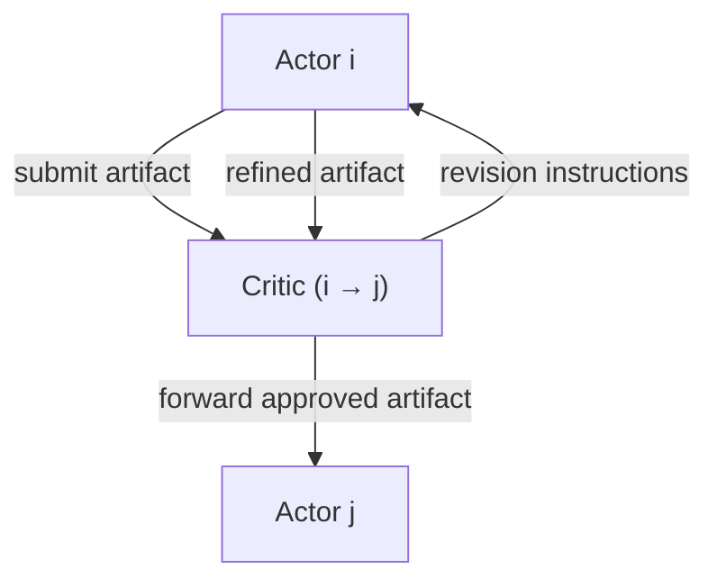

> [!tldr] TL;DR
> Problem: existing multi-agent systems work well at small scale, but unstructured scaling collapses under coordination and context costs.
> Approach: the authors design MACNET, a DAG-based multi-agent collaboration network, for effective agent scaling.
> Observation: performance grows in a logistic curve as agents are added, and irregular topologies consistently beat regular ones.
> One-line summary: if adding neurons improved neural networks, could adding agents improve multi-agent systems?

## Introduction

LLM research has confirmed that multi-agent collaboration outperforms a single agent, but scaling up the number of agents has been relatively overlooked. A few studies reached dozens of agents, yet most used fewer than ten.
Just as neural networks revealed a scaling law when neuron counts grew, this work starts from the question of whether a similar scaling law applies to the number of agents.

> [!question] Research Question
> How can we scale agents effectively? Does agent scaling actually improve performance?

Effective collaboration, however, cannot rely on simply adding agents and taking a majority vote. Effective scaling requires ==scalable networking, cooperative interaction, and progressive decision-making==: the network must be easy to grow, and agents must cooperate and make decisions incrementally.

> Majority voting has no interaction or refinement, and as the number of agents grows it inevitably multiplies redundant information and cost.


To address this, the study proposes the multi-agent collaboration network (MACNET).

## Method / Approach



> **The structural conditions for effective agent scaling** can be summarized as three elements: **scalable networking, cooperative interaction, and progressive decision making**.

To satisfy these conditions, MACNET is designed as a **Directed Acyclic Graph (DAG)-based collaboration network that structurally constrains the order of agent interactions and the flow of information**. The DAG here is not a mere implementation choice; it works as the **minimal structural constraint** that makes large-scale agent collaboration possible.

A DAG is a directed graph with no cycles: it structurally blocks information **backflow** and makes task-specific cycle breaking unnecessary. If cyclic structures (A → B → C → A) were allowed, interaction costs would explode as agents are added, and **local errors such as flawed intermediate judgments or hallucinations could be amplified and propagated repeatedly**.

In a DAG, by contrast, interactions proceed in topological order, enabling **progressive decision making** where decisions accumulate step by step, and the entire collaboration is **structurally guaranteed to terminate within a finite number of steps**. As a result, no separate termination condition needs to be designed per agent or node.

Given this structural constraint, let us look at what network shape (topology) is needed, what role each component plays and how they interact, and how to control the context explosion that large-scale collaboration causes.

> “A graph will orchestrate agent interactions, akin to social networks where information propagates through directed edges. Intuitively, ==the acyclic nature prevents information backflow, eliminating the need for additional designs like task-specific cycle-breaking, thereby enhancing generalizability and adaptability across contexts==.” (Qian et al., 2025, p. 3)

### How Should the Topology Be Composed?

> What do these shapes look like?

The paper offers a two-level taxonomy: chain, tree, and graph.


- Chain:
  - linear structure (similar to the [[Waterfall Model]])
- Tree:
  - Star (wider), Tree (deeper)
- Graph:
  - Mesh (fully-connected), Layer (Multi-Layer Perceptron shaped), Random (irregular)

### **Interactive Reasoning**: How Do Agents Interact?

In MACNET, both **nodes** and **edges** are implemented as LLM-based agents. A node (Actor, $a_i$) takes an incoming artifact, produces a revised artifact, and keeps the current artifact version along with the decision made at that point. An edge (Critic, $a_{ij}$) is the mediator agent for $v_i \rightarrow v_j$: it never produces artifacts itself and only provides **directional instruction** about what to revise and which criteria to apply.

#### Follow the Topological Order

Agent interactions are structurally restricted by the DAG's **topological ordering**. For every directed edge $v_i \rightarrow v_j$, the following holds:
$$I(a_i) < I(a_{ij}) < I(a_j)$$
This ordering is enforced and means a decision flow of **Actor → Critic → next Actor**. Under this constraint parallel execution is allowed, but dependencies are never violated.

The DAG's nodes and edges repeat the following process through multi-turn dialogue. First, in the $a_i \leftrightarrow a_{ij}$ segment, the Critic gives feedback and the Actor refines the artifact. Then, in the $a_{ij} \leftrightarrow a_j$ segment, the refined artifact passes through the Critic to the next Actor for further improvement.

#### Dataflow Runs on Nodes and Edges

In MACNET, dataflow is the path an artifact travels through the network; artifacts propagate according to the topology of the connected nodes.

### Consideration: Memory Control

The risk of agent scaling is that unconstrained information exchange causes context explosion. For example, without memory control, if each of n agents exchanges n memories, the cost grows as $O(n^2)$. The paper mitigates this with a short-term/long-term memory design that discards conversation history and keeps only the final artifact.

> [!warning] Memory Control (Context Explosion)
> Unrestricted information exchange can cause context explosion.
> The paper mitigates the complexity with short-term/long-term memory, discarding dialogue history and keeping the final artifact.

- Short-term memory:
  - working memory within each interaction
  - task, role prompt, current artifact
- Long-term memory:
  - keeps only the artifact that becomes the final output

Short-term memory is the working memory of each interaction and contains the task, the role prompt, and the current artifact. Long-term memory keeps only the artifact that will become the final output. In other words, each of the n agents uses short-term memory locally while long-term memory retains only the final artifact, discarding dialogue history and lowering storage/transfer complexity to $O(n)$.

## Results and Observations

> Performance comparison
>
> - MACNET-Chain beats the baselines on most metrics
> - MACNET-Random achieves the best average Quality (0.6522)
> - Certain topologies fit certain tasks: chain → software development, tree → creative writing

### How Should Topology Be Analyzed?

#### Density Perspective: How Densely Connected?


- Higher interaction density performs better on average (mesh > tree > chain)
  - Variance is presumed to depend on task characteristics.
    - Chain structures perform well in software engineering, because software engineering tends to follow a linear process.
    - For tasks demanding high creativity, connections across diverse agents can be more advantageous.
    - However, this suggests density does not always yield optimal performance.

Higher interaction density performed better on average (mesh > tree > chain). Still, variance exists across task types: software engineering tends to follow a linear process, so a chain structure can work better there, while tasks that demand high creativity can benefit from connecting diverse agents. It also suggests that density alone never guarantees optimal performance.

#### Shape Perspective: How Is the Graph Pattern Composed?

Irregular topologies (random) were observed to outperform regular ones. The interpretation is that overly dense interactions overload agents with information and hinder effective reflection and refinement. Small-world properties also contributed to performance: shorter paths make information transfer and refinement easier. Notably, the random topology also reported about 52% time savings compared to mesh.

#### Direction Perspective

Divergent topologies beat convergent ones; the interpretation is that divergent structures can consider more diverse opinions, which improves performance. Artifact propagation also proceeded more smoothly in divergent structures.

### So… Does a Scaling Law Hold for Agents?


Performance was observed to increase logistically as agents were added.

However, rather than the agents becoming smarter as their number grows, the performance gain is attributed to the agents jointly considering more facets of the task through their interactions.

## Conclusion

The study confirms that MACNET works effectively and that a collaborative scaling law exists. That said, which topology and how much agent scaling is optimal when building a MACNET can vary by task scenario. A limitation is that while the scaling law was observed, the paper does not identify which structure is optimal in which scenario.

In summary, MACNET dominated all baselines on average and effectively supported 1000+ agent collaboration. It discovered a collaborative scaling law in which performance improves in a logistic growth pattern (the term is first defined in this paper), and when scaling the number of agents, irregular topologies outperformed regular ones on average (Regular: Chain, Star, Tree, Layer / Irregular: Random, Mesh). Finally, agent collaboration offers inference-time procedural thinking as an alternative to training-time scaling, acting as a “shortcut” that improves performance at inference rather than training.

## Questions

### Does Each Critic Really Get a Different Role?

While presenting this review I was asked about the Critic's role. The paper only says each Critic sits on an edge and mediates between two nodes. So do all Critics play the same “supervisor” role, or does each Critic carry a specialized one?

Equation 2 states that each agent has "professional roles", and the ablation study in Section 3.1 shows an average 3.67% performance drop when agents' profiles are removed. This suggests each agent's specialization genuinely contributes to performance. More concretely, Figure 8 in Section 3.4 shows the ChatDev implementation reviewing 54 distinct aspects (Syntax Errors, Runtime Errors, Logic Errors, Security Vulnerabilities, Performance Issues, and so on). If every Critic performed the same role, it could not cover such diverse aspects.

Checking the actual [GitHub ChatDev MACNET branch](https://github.com/OpenBMB/ChatDev/tree/macnet) implementation, each Phase defines a different Critic class. In `phase.py`, the `DemandAnalysis` Phase casts the CEO as Critic and the CPO as Actor, while the `Coding` Phase assigns the CTO as Critic and the Programmer as Actor. In the `CodeReviewComment` Phase the Code Reviewer becomes the Critic, and in the `TestModification` Phase the Test Engineer takes the Critic role. In other words, each stage of the development process gets a Critic specialized for that stage.

Even more interesting is the `SRDD_Profile` system. The ChatDev implementation ships 40 categories × 100 profiles = 4,000 distinct role prompts under `./SRDD_Profile/{category}/{1-99}.txt`. For example, `Development/1.txt` is an algorithms expert, `Development/10.txt` a mobile development expert, `Entertainment/15.txt` an AI/ML expert, and `Finance/22.txt` a deployment/risk-management expert — each profile defines its own expertise and skill set. And the `agent_deployment(self, _type)` method at `graph.py:400-439` contains the following code:

```python
profile_num = random.randint(1, 99)
with open(f"./SRDD_Profile/{_type}/{profile_num}.txt", "r", encoding="utf-8") as f:
    self.nodes[node.id].system_message = f.read()
```

That is, every time a node is created, a profile is randomly chosen from 1–99 to give it a distinct specialization.

Then why does the paper not describe this role differentiation explicitly? Three reasons seem plausible. First, the paper's core contributions are the "DAG-based collaboration structure" and the "agent scaling law", so role assignment may have been treated as an implementation detail. Second, since ChatDev is an implementation example for one application domain (software development), a paper describing the general MACNET framework may have avoided going deep into a domain-specific role system. Third, the 4,000 profiles and the random assignment mechanism are debatable in terms of reproducibility and fairness, so the paper may have mentioned them only briefly on purpose.

In conclusion, there is strong evidence at four levels that each Critic is assigned a different role: (1) the 3.67% performance drop when profiles are removed in the ablation study, (2) the 54 distinct review aspects, (3) the phase-specialized Critic classes (CEO, CTO, Code Reviewer, Test Engineer, and so on), and (4) the 4,000-profile SRDD_Profile system with random assignment. In MACNET, therefore, each Critic functions not as an identical supervisor but as a domain expert with its own specialty.
