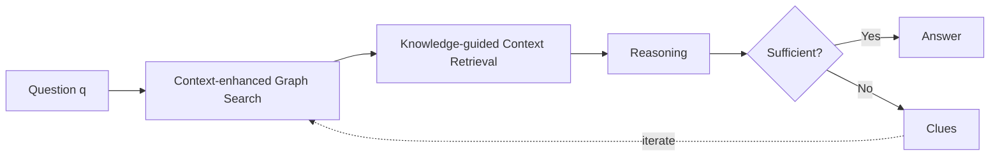

## Introduction

Since the end of October 2025, I have been reading and reviewing papers on the topic of Agent with my friend Seok. It seems like it's already been about 3 months. The original goal was to read and write logical articles, and then a good example of logical writing is a paper, and since each of us is interested in Agent, we are trying to review papers every week in a free way. For me, it is a practice of consistently reading papers and re-organizing them.

---

Today's topic is a paper submitted to ICLR in 2025 called Think on graph 2.0. It provides an approach to RAG.

> Retriever-Augmented Generation (RAG)
> **RAG** ​​is a large-scale language model (LLM) technique that retrieves relevant information from external knowledge sources before generating a response, and includes that information in the LLM's input to create the answer.**

Why is RAG related to Agent? At this point, Agent refers to LLM operating as a core engine, handling various tools and carrying out goals through a feedback loop. At this time, since RAG is a representative example as a tool to supplement the knowledge lacking in the stateless language model, it was judged that RAG is related to Agent.

## Background

![[20260111 Think-on-Graph.png]]

The existing RAG had problems with lack of in-depth search or completeness of answers.
Text-based RAG can measure semantic similarity, but it has difficulty capturing sturtural relationships because it stores information in chunks. Graph-based RAG can capture relationships, but has difficulty validating whether the retrieved information is semantically similar.

To overcome this, the KG + Text approach also appeared, but the weakly coupled hybrid method still had difficulty retrieving detailed information through complex queries.

Therefore, to overcome the limitations of the existing RAG approach, we propose Think-on-Graph 2, a more advanced hybrid approach.

- Existing RAG
  - Text based RAG
    - Effective for measuring semantic similarity
    - Unsuitable for multi-step reasoning or tracking logical links between information fragments
  - Knowledge graph based RAG
    - Effective for structuring high-level concepts and relationships
    - Suffers from inner incompleteness and lack of information beyond their Ontology
  - KG+Text RAG (Hybrid RAG)
    - **Loose coupling** combination still falls short in handling complex queries that require detailed information obtained through in-depth retrieval

## Methods : Think-on-Graph 2.0

> [!NOTE]+ TL;DR
> Think-on-graph workflow
>
> 1. Context-enhanced Graph Search (Shall we expand the candidates?)
> 2. Knowledge-guided Context Retrieval (Is the candidate found useful?)
> 3. Reasoning (Has enough information been gathered?)

![[20260111 Think-on-Graph Workflow.png]]

ToG-2 works by finding related topics using a graph-based method, validating the information found through semantic search of text-based RAG, and repeatedly improving the quality of the query by determining whether to iterate to the language model.

In the Context-enhanced Graph Search stage, starting from the topic entity, the search is performed to a specified width of $W$. Next, the information found is pruned, and at the end, a prompt is issued in the reasoning stage to determine whether the knowledge is sufficient or insufficient.

> **Notation**
>
> - $\mathcal{E}^i_{topic} = \{e^i_1, e^i_2, …, e^i_j\}$: topic entities of $i$th iteration
> - $\mathcal{P}^{i-1} = \{P^{i-1}_1, P^{i-1}_2, …, P^{i-1}_j\}$: Previous triple paths
> - $P^{i-1}_j = \{p^0_j, p^1_j, …, p^{i-1}_j\}$: path composed of multiple triples
> - $p^{i-1}_j = (e^{i-1}_j, r^{i-1}_j, e^i_j)$: A single triple representing the relation between two entities.
> - $W$: exploration width (maximum number of topic entities maintained in each iteration)
> - $j \in [1, W]$
> - When $i = 0$ is initialization phase, $P^0$ is empty.

At each iteration, the graph is searched from topic entities, and the search path is accumulated as a triple path. Expand width-first while maintaining $W$ entities.

### Prune

#### Relation Prune

In the Graph Search step, this is the step of removing relations that are not related to the question among the edges connected to each topic entity. Provide LLM with question $q$, entity, and connected edges to select only relevant relations.

> 1. Pruning based on individual entities
>    $$PROMPT_{RP}(e^i_j, q, Edge(e^i_j))$$
> 2. Pruning edges of multiple entities at once using a combined method
>    $$PROMPT_{RP\_cmb}(\mathcal{E}^i_{topic}, q, \{Edge(e^i_j)\}^W_{j=1})$$
>    $Edge(e^i_j)$: All edges (relation) connected to entity $e^i_j$

#### Context Based Entity Prune

This is the final selection step using text-based semantic similarity for candidate entities that have passed Relation Prune.

> **1. Calculate Chunk Relevance Score**
> $$s^i_{j,m,z} = DRM(q, [triple\_sentence(Pc^i_{j,m}) : chunk^i_{j,m,z}])$$
>
> - $triple\_sentence(Pc^i_{j,m})$: Convert KG's triple path into natural language sentences
> - $chunk^i_{j,m,z}$: zth text chunk connected to candidate entity
>
> **2. Calculate Entity Ranking Score**
> $$score(c^i_{j,m}) = \sum_{k=1}^{K} s_k \cdot w_k \cdot \mathbb{I}(\text{The kth chunk is} c^i_{j,m} \text{If it comes from})$$
>
> - $w_k = e^{-\alpha \cdot k}$: The higher the rank, the higher the weight given.
> - $\mathbb{I}$: indicator function (1 if the condition is true, 0 if it is false)
> - $K$, $\alpha$: hyperparameters

First, the relevance score is calculated using DRM for the text chunks of each candidate entity. Then, all chunks are sorted in order of score, and the final entity ranking score is obtained by summing the scores of chunks from the corresponding entity among the top-K chunks with exponential decay weights. Only entities with a high score survive.

> What is **Dense Retrieval Model (DRM)**?
> A model that measures semantic similarity by converting text into dense vector (embedding). After converting Query and Document into embeddings, calculate the similarity using cosine similarity.

### Reasoning

This is the stage where LLM determines whether the collected context is sufficient to answer the question.

$$PROMPT_{rs}(q, \mathcal{P}^i, Ctx^i, Clues^{i-1}) = \begin{cases} Ans., & \text{if knowledge is sufficient} \\ Clues^i, & \text{otherwise} \end{cases}$$

- $q$: original question
- $\mathcal{P}^i$: Triple paths explored so far
- $Ctx^i$: Collected context (text chunks)
- $Clues^{i-1}$: Clues discovered in previous iterations

If knowledge is sufficient, **Answer** is created, and if knowledge is insufficient, **Clues** are created to guide the search direction of the next iteration.

## Results

> **Benchmarks**
>
> - **WebQSP**: Freebase-based Knowledge Base QA. multi-hop reasoning evaluation
> - **AdvHotpotQA**: Adversarial version of HotpotQA. More difficult multi-hop QA
> - **QALD-10-en**: Linked Data-based QA. Natural language → SPARQL query transformation evaluation
> - **FEVER**: Fact Verification based on Wikipedia. True/False Verification of Claims
> - **Creak**: Commonsense Reasoning. Detecting subtle violations of common sense
> - **Zero-Shot RE**: Zero-shot Relation Extraction. Extract relations not seen during learning
> - **ToG-FinQA**: Financial QA. Numerical/logical reasoning in financial reports

### Table 1. GPT-3.5-turbo Baseline performance comparison

| Baseline Type  | Method      | WebQSP (EM) | AdvHotpotQA (EM) | QALD-10-en (EM) | FEVER (Acc.) | Creak (Acc.) | Zero-Shot RE (EM) |
| -------------- | ----------- | ----------- | ---------------- | --------------- | ------------ | ------------ | ----------------- |
| LLM-only       | Direct      | 65.9%       | 23.1%            | 42.0%           | 51.8%        | 89.7%        | 27.7%             |
|                | CoT         | 59.9%       | 30.8%            | 42.9%           | 57.8%        | 90.1%        | 28.8%             |
|                | CoT-SC      | 61.1%       | 34.4%            | 45.3%           | 59.9%        | 90.8%        | 45.4%             |
| Text-based RAG | Vanilla RAG | 67.9%       | 23.7%            | 42.4%           | 53.8%        | 89.7%        | 29.5%             |
| KG-based RAG   | ToG         | 76.2%       | 26.3%            | 50.2%           | 52.7%        | **93.8%**    | 88.0%             |
| Hybrid RAG     | CoK         | 77.6%       | 35.4%            | 47.1%           | **63.5%**    | 90.4%        | 75.5%             |
| **Proposed**   | **ToG-2**   | **81.1%**   | **42.9%**        | **54.1%**       | 63.1%        | 93.5%        | **91.0%**         |

ToG-2 shows the highest performance on most datasets. In particular, the best performance was achieved in WebQSP, AdvHotpotQA, QALD-10-en, and Zero-Shot RE.

### Table 2. Performance comparison in various backbone models

| Dataset     | Llama-3-8B Direct | Llama-3-8B ToG-2  | Qwen2-7B Direct | Qwen2-7B ToG-2    | GPT-3.5-turbo Direct | GPT-3.5-turbo ToG-2 | GPT-4o Direct | GPT-4o ToG-2      |
| ----------- | ----------------- | ----------------- | --------------- | ----------------- | -------------------- | ------------------- | ------------- | ----------------- |
| AdvHotpotQA | 20.8              | 34.7 (**66.8%↑**) | 17.9            | 30.8 (**72.1%↑**) | 23.1                 | 42.9 (**85.7%↑**)   | 47.7          | 53.3 (**11.3%↑**) |
| FEVER       | 35.5              | 52.9 (**49.0%↑**) | 38.6            | 53.1 (**38.1%↑**) | 51.8                 | 63.1 (**21.8%↑**)   | 66.2          | 70.1 (**5.9%↑**)  |
| ToG-FinQA   | 0                 | 8.2               | 0               | 10.3              | 0                    | 34.0                | 0             | 36.1              |

No matter which backbone model is used, performance is greatly improved when ToG-2 is applied. In particular, the improvement is larger in smaller models (Llama-3-8B, Qwen2-7B).

### Table 3. Performance changes according to KG Completeness

| KG Completeness (%) | Exploration Setting | EM (%) |
| ------------------- | ------------------- | ------ |
| 100                 | Default (W=3, D=3)  | 43     |
| 80                  | Default             | 41     |
| 50                  | Default             | 35     |
| 30                  | Default             | 23     |
| 30                  | Adjusted (W=8, D=2) | 29     |

Even if KG is imperfect, ToG-2 maintains some performance. When KG completeness drops to 30%, performance degradation can be alleviated by adjusting the exploration setting (W=8, D=2).

## Appendix

