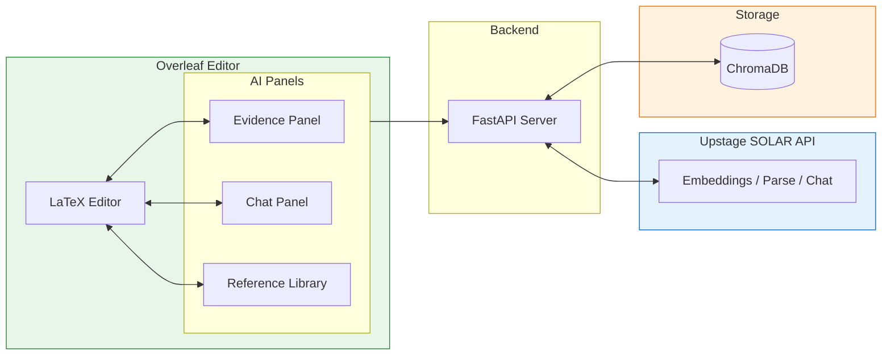
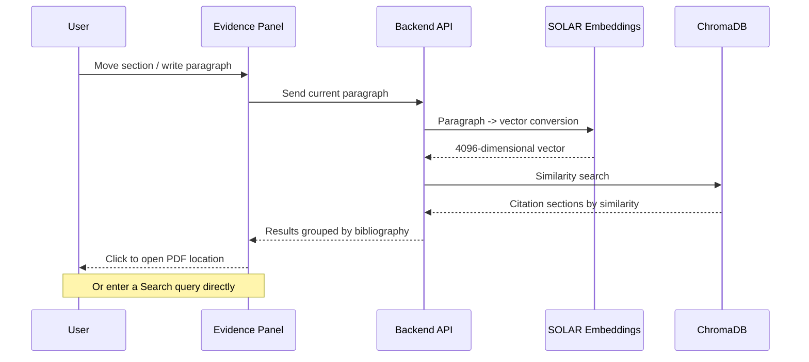
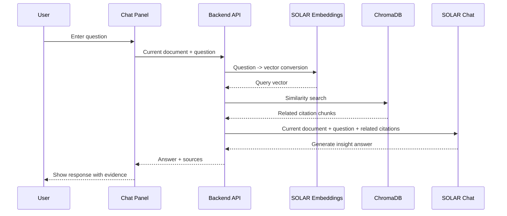

# My Awesome RA: AI-Powered Research Assistant for Evidence-Based Academic Writing

## Introduction

Hello, I am Beomsoo Ko, and I recently graduated from graduate school.
As a novice researcher working through the process of completing a paper all the way to a submission-ready form for the first time, I found that my flow was interrupted more often by **checking evidence and organizing citations** than by the act of writing itself.

I mainly wrote papers in Overleaf. But writing a paper longer than 10,000 characters felt less like simply producing sentences and more like **sustaining the context of thought and cognitive energy over a long period of time**. In particular, as my graduate thesis expanded into conference and journal submissions, I had to readjust the structure and tone whenever the publication format changed while preserving the same line of reasoning. That repeated process became a recurring burden.

Whenever literature was added or removed, I had to check again whether the existing claims and citations were still valid. As the document grew longer, I felt the limits of performing this review manually. From this experience, I concluded that I needed **a way to continuously check citations and related research inside a single editor**.

For this project, I forked **Overleaf**, the paper-writing tool I used most often, and implemented **My Awesome RA**, which adds an AI-powered reference management panel.

### Project Summary Image

## 1. Problem Definition

In the paper-writing process, searching for and verifying evidence to cite often happens outside the editor, which repeatedly breaks the writing flow. This makes it difficult to quickly identify the evidence needed for the paragraph currently being written, and context is lost while switching between PDF viewers, reference tools, and the editor. As a result, the connection between evidence and claims weakens, citation accuracy and overall document consistency decline, and the cost of revising and expanding the document increases sharply as the document grows longer.

**In short, the problem can be summarized in three points.**

- **Broken writing context**: Searching for evidence outside the editor and frequent context switching repeatedly interrupt the flow of thought.
- **Weakened evidence-claim connection**: It is difficult to immediately verify which evidence a citation actually supports.
- **Increasing expansion cost**: As the document grows longer, it becomes harder to manually manage inconsistencies in citations, terminology, and logic.

**The limitations of the existing workflow are as follows.**

- Ctrl+F-based search makes it difficult to find the evidence you need when the wording differs.
- Moving between multiple tools such as Zotero, Obsidian, and Notion to check evidence easily scatters focus and context.
- Citation formats can be managed, but the connection to the specific evidence being cited can easily become weak.
- As the document grows longer, the cognitive cost of manually checking overall consistency increases sharply.

## 2. Solution: My Awesome RA

I forked Overleaf Community Edition, an open-source LaTeX editor, and configured it so that users can **continuously check citations and related research inside a single editor**.

I added three AI panels: (1) **Evidence Panel**, which automatically reads the paragraph currently being written and recommends relevant evidence; (2) **Chat Panel**, where users can ask questions directly about their references and receive answers; and (3) **Reference Library**, where uploaded PDFs can be managed and automatically turned into a searchable index.

With this, the flow from "writing a paragraph -> checking evidence -> asking questions -> inserting citations" can be performed **without leaving the editor**.

In this process, I used Upstage's SOLAR API in three ways.

### How the Upstage API Is Used

| API                | Endpoint                         | Purpose                                            |
| ------------------ | -------------------------------- | -------------------------------------------------- |
| **Embeddings**     | `/v1/solar/embeddings`           | Convert text into vectors (paragraph/reference embeddings) |
| **Document Parse** | `/v1/document-ai/document-parse` | Extract text and page information from PDFs        |
| **Chat**           | `/v1/solar/chat/completions`     | Generate evidence-based answers                    |

**Workflow:** PDF upload -> text extraction with Document Parse -> vectorization with Embeddings -> storage in ChromaDB -> retrieval with Embeddings while writing a paragraph -> answer generation with Chat

## 3. Actual Screens

Here is how it works in practice.

### 3.1 Evidence Panel: Automatically Finding Evidence

When writing a paper and needing evidence to support the current paragraph, the Evidence Panel automatically retrieves sections from related papers in order of similarity based on the paragraph selected in the editor. Search results are organized by bibliography entry and show the actual section content extracted from embedded PDFs. With one click, users can check citation evidence related to the section they are currently writing or jump directly to the exact location in the original PDF.

In addition to automatic recommendations, it also provides a Search feature that lets users enter a query directly to find related papers.

**How it works:**

When the user moves between sections, citation sections sorted by similarity are loaded automatically. Clicking each result opens the exact location in the corresponding PDF.

**Reference Library Management:**
For the Evidence Panel, references are managed through the **Reference Library**. Users can upload PDFs, check indexing status, and trigger embedding attempts. Uploaded PDFs are automatically indexed through the Upstage Document Parse API.

### 3.2 Chat Panel: Conversation as a Research Assistant

In the Chat Panel, users can **ask direct questions about the paper they are writing**. The Chat Panel generates answers based on the document currently open in the editor, the user's question, and related citations. In this way, it goes beyond simple information retrieval and serves as a **research assistant** that can help generate insights.

**How it works:**

Because answers are generated while considering the context of the document currently being written together with related citations, the result is not an "AI-invented answer" but research assistance grounded in actual references.

## 4. Expected Impact

It was fun to directly implement something I had often wished existed while writing papers in Overleaf. In particular, it was impressive to follow Overleaf's existing UI patterns and add a new feature in a way that felt natural, as if it had originally belonged there. The expected impact of the tool I built for this demo is not to replace researchers, but to augment them so they can focus on research itself. The goal was to create a Research Assistant where AI handles the repetitive work of finding and checking evidence, allowing researchers to spend more time building logic and developing claims. In the AI era, the methods and roles of research are also changing, and there are still points of debate. Still, I think this demo can serve as one example of what a tool for augmenting oneself might look like within that broader shift.
